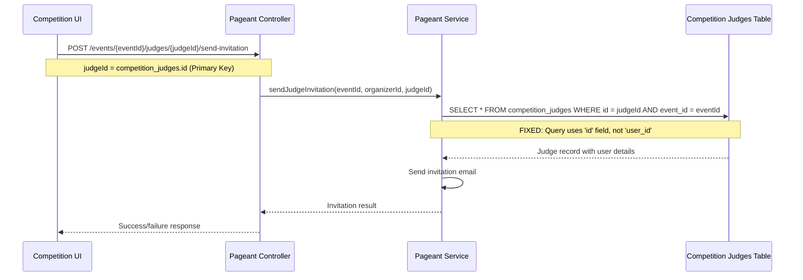

# Design Document

## Overview

This design addresses the critical database lookup bug in the Votrix competition module's judge invitation system. The issue occurred because the `sendJudgeInvitation` function was incorrectly querying the `competition_judges` table using the `user_id` field instead of the `id` field, causing valid judge invitation requests to fail with "Judge is not enrolled in this event" errors.

The fix involves correcting the database query to use the proper primary key field (`id`) when looking up judge records for invitation purposes, ensuring consistent behavior between the frontend-backend API contract and the database schema design.

## Architecture

### Database Schema Analysis

The `competition_judges` table has the following structure:
```sql
CREATE TABLE competition_judges (
    id UUID PRIMARY KEY DEFAULT gen_random_uuid(),           -- Primary key
    event_id UUID NOT NULL REFERENCES events (id),          -- Event foreign key
    user_id UUID NOT NULL REFERENCES users (id),            -- User foreign key  
    role competition_judge_role NOT NULL DEFAULT 'judge',
    display_name VARCHAR(255),
    is_active BOOLEAN NOT NULL DEFAULT TRUE,
    has_submitted BOOLEAN NOT NULL DEFAULT FALSE,
    created_at TIMESTAMPTZ NOT NULL DEFAULT NOW(),
    updated_at TIMESTAMPTZ NOT NULL DEFAULT NOW(),
    CONSTRAINT competition_judges_unique UNIQUE (event_id, user_id)
);
```

### API Flow Architecture



### Data Flow Correction

**Before (Buggy Implementation):**
```javascript
// INCORRECT - judgeId is competition_judges.id, but query uses user_id
.eq('user_id', judgeId)  // WRONG FIELD!
```

**After (Fixed Implementation):**
```javascript
// CORRECT - judgeId is competition_judges.id, query uses id
.eq('id', judgeId)  // CORRECT FIELD!
```

## Components and Interfaces

### Frontend Component Interface

The frontend `CompetitionJudgesPage` component interacts with the invitation system through:

**Input**: Judge list with dual ID fields from `listJudges` API:
```javascript
{
  id: "uuid-primary-key",           // competition_judges.id (PRIMARY)
  judgeId: "uuid-user-reference",   // users.id (FOREIGN REFERENCE)
  email: "judge@example.com",
  firstName: "John", 
  lastName: "Doe",
  hasScored: false,
  invitationSent: false
}
```

**Action**: Invitation request using PRIMARY key:
```javascript
const handleSendInvitation = async (judgeId) => {
  // judgeId parameter should be the 'id' field (primary key)
  const result = await pageantService.sendJudgeInvitation(eventId, judgeId)
}
```

### Backend API Interface

**Route**: `POST /organizer/events/:eventId/judges/:judgeId/send-invitation`

**Parameters**:
- `eventId`: UUID of the competition event
- `judgeId`: UUID representing `competition_judges.id` (PRIMARY KEY)

**Controller Implementation**:
```javascript
export const sendJudgeInvitation = asyncHandler(async (req, res) => {
  const result = await pageantService.sendJudgeInvitation(
    req.params.eventId,    // Event ID
    req.user.id,           // Organizer ID  
    req.params.judgeId,    // Judge PRIMARY KEY (competition_judges.id)
  )
  res.json({
    success: true,
    invitationSent: result.invitationSent,
    email: result.email,
  })
})
```

### Service Layer Interface

**Service Function Signature**:
```javascript
async function sendJudgeInvitation(eventId, organizerId, judgeId)
```

**Database Query (FIXED)**:
```javascript
const { data: judgeRow, error: judgeRowErr } = await getClient()
  .from(DB_TABLES.COMPETITION_JUDGES)
  .select('user_id, users (id, email, must_change_password)')
  .eq('id', judgeId)              // CORRECT: Use primary key
  .eq('event_id', eventId)        // Event constraint
  .maybeSingle()
```

**Return Interface**:
```javascript
{
  email: { sent: boolean, messageId: string },
  invitationSent: boolean,
  invitationType: 'new' | 'existing',
  temporaryPassword: string | null
}
```

## Data Models

### Competition Judge Entity

```typescript
interface CompetitionJudge {
  // Primary identification
  id: string;                     // UUID - Primary key for judge record
  eventId: string;               // UUID - Event this judge is enrolled in
  userId: string;                // UUID - Reference to users table
  
  // Judge attributes  
  role: 'judge' | 'head_judge';  // Judge role in competition
  displayName: string | null;    // Optional display name
  isActive: boolean;             // Whether judge is currently active
  hasSubmitted: boolean;         // Whether judge has submitted scores
  
  // Timestamps
  createdAt: Date;
  updatedAt: Date;
  
  // User relationship (joined data)
  user?: {
    id: string;
    email: string;
    mustChangePassword: boolean;
  }
}
```

### Judge List Response Model

```typescript
interface JudgeListItem {
  id: string;                    // competition_judges.id (PRIMARY KEY for invitations)
  judgeId: string;               // users.id (for display/reference only)
  email: string;
  firstName: string | null;
  lastName: string | null;  
  hasScored: boolean;
  metadata: object;
  invitationSent: boolean;
}
```

### Invitation Request Model

```typescript
interface InvitationRequest {
  eventId: string;               // Competition event ID
  judgeId: string;               // competition_judges.id (NOT user_id)
  organizerId: string;           // Requesting organizer ID
}
```

## Correctness Properties

*A property is a characteristic or behavior that should hold true across all valid executions of a system-essentially, a formal statement about what the system should do. Properties serve as the bridge between human-readable specifications and machine-verifiable correctness guarantees.*

### Property 1: Primary Key Database Lookup Correctness

*For any* enrolled judge record in the competition_judges table, querying with the primary key (`id` field) should successfully return the correct judge data including user information.

**Validates: Requirements 1.1, 1.2, 1.4**

### Property 2: Foreign Key Relationship Preservation

*For any* judge invitation operation, the foreign key relationships between competition_judges and users tables should remain intact and consistent before and after the operation.

**Validates: Requirements 1.5, 3.1, 3.2**

### Property 3: Error Message Accuracy for Enrolled Judges

*For any* properly enrolled judge with a valid primary key, the invitation system should never return "Judge is not enrolled in this event" when using the correct primary key lookup.

**Validates: Requirements 2.1, 5.1**

### Property 4: Legitimate Error Handling

*For any* non-existent judge primary key, the system should return the appropriate "Judge is not enrolled in this event" error message.

**Validates: Requirements 2.2, 5.3**

### Property 5: Input Validation Consistency

*For any* judge ID parameter, the system should validate that it corresponds to an existing primary key value before attempting invitation operations.

**Validates: Requirements 2.3, 2.5**

### Property 6: Judge Enrollment Status Invariance

*For any* judge invitation operation, the judge's enrollment status and metadata should remain unchanged before and after the invitation process.

**Validates: Requirements 3.3, 5.5**

### Property 7: Unique Judge Identification in Multi-Judge Events

*For any* event with multiple enrolled judges, each judge should be uniquely and correctly identified using their distinct primary key values.

**Validates: Requirements 3.4, 3.5, 5.4**

### Property 8: Response Format Consistency

*For any* judge invitation request (new or existing account), the system should return consistent response structure and format regardless of the judge's account status.

**Validates: Requirements 4.4, 5.2**

## Error Handling

### Database Query Errors

**Primary Key Not Found**: When a judge ID does not exist in the `competition_judges` table:
```javascript
{
  success: false,
  error: "Judge is not enrolled in this event",
  code: 404
}
```

**Database Connection Failures**: When Supabase connectivity issues occur:
```javascript
{
  success: false, 
  error: "Database connection failed",
  code: 500,
  technical: error.message
}
```

**Query Constraint Violations**: When foreign key constraints are violated:
```javascript
{
  success: false,
  error: "Data integrity violation", 
  code: 500,
  constraint: "competition_judges_event_id_fkey"
}
```

### Invitation System Errors

**Email Service Failures**: When invitation emails cannot be sent:
```javascript
{
  success: true,           // Judge lookup succeeded
  invitationSent: false,   // Email failed
  email: { 
    sent: false, 
    error: "Email service unavailable" 
  }
}
```

**Authentication Errors**: When organizer lacks permission:
```javascript
{
  success: false,
  error: "Organizer does not own this event",
  code: 403
}
```

### Error Recovery Strategies

1. **Database Lookup Failures**: Retry with exponential backoff for transient connection issues
2. **Email Delivery Failures**: Queue for retry, mark invitation as pending
3. **Validation Errors**: Return immediately with specific error messages
4. **Permission Errors**: Log security event, return authorization error

## Testing Strategy

### Dual Testing Approach

**Unit Tests**: 
- Test specific database query corrections with mocked database responses
- Test error handling for various failure scenarios  
- Test input validation logic with boundary conditions
- Test response format consistency across account types

**Property-Based Tests**:
- Verify primary key lookups work correctly across all valid judge records
- Test foreign key relationship preservation through invitation operations
- Validate error message accuracy for various input combinations
- Ensure unique identification works in multi-judge scenarios

### Property Test Configuration

- **Testing Library**: Use Jest with fast-check for JavaScript property-based testing
- **Minimum Iterations**: 100 iterations per property test
- **Test Environment**: Isolated test database with controlled judge/event data
- **Mock Strategy**: Mock email services but use real database queries for accuracy

### Property Test Tags

Each property test must reference its design document property:

```javascript
describe('Judge Invitation Database Lookup', () => {
  test('Property 1: Primary Key Database Lookup Correctness', async () => {
    // Feature: judge-invitation-database-fix, Property 1: Primary Key Database Lookup Correctness
    // Test implementation...
  })
  
  test('Property 3: Error Message Accuracy for Enrolled Judges', async () => {
    // Feature: judge-invitation-database-fix, Property 3: Error Message Accuracy for Enrolled Judges  
    // Test implementation...
  })
})
```

### Integration Testing Scope

**Frontend-Backend Integration**:
- Test complete judge invitation flow from UI to email delivery
- Verify correct parameter passing between frontend and backend
- Test error handling and user feedback mechanisms

**Database Integration**: 
- Test against real Supabase instance with proper foreign key constraints
- Verify query performance with realistic judge data volumes
- Test concurrent invitation operations for race condition detection

**Email Integration**:
- Test email template rendering with judge data
- Verify email delivery tracking and status reporting
- Test email service failover and retry mechanisms

<function_calls>
<invoke name="prework">
<parameter name="featureName">judge-invitation-database-fix