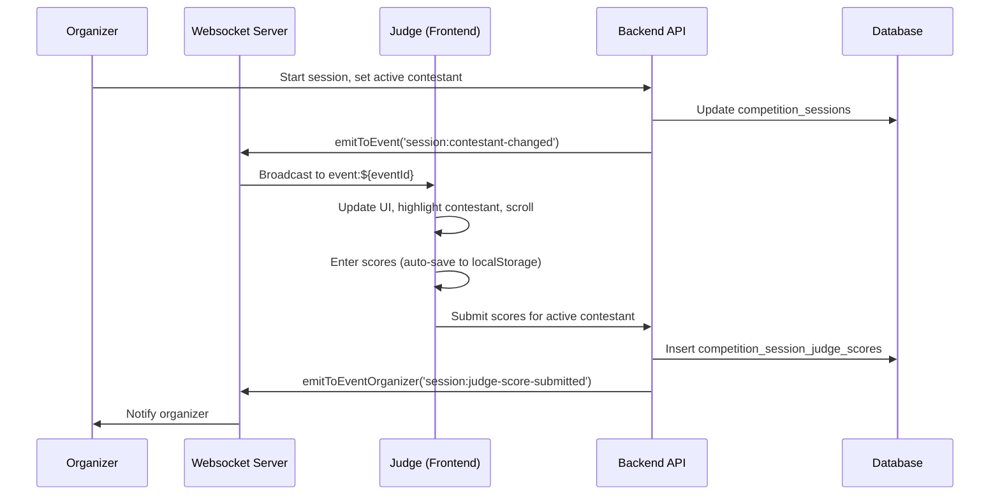
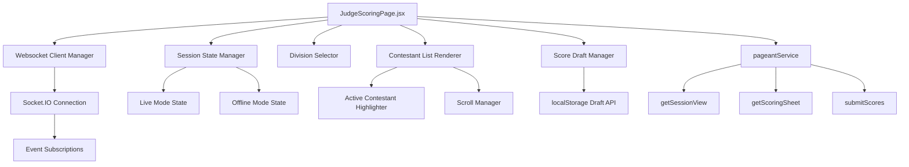

# Technical Design Document: Live-Aware Judge Scoring Experience

## Overview

The Live-Aware Judge Scoring Experience transforms the judge scoring page from a static, offline-only interface into a real-time, session-aware system that responds to organizer control during live competition sessions. This design integrates websocket-based real-time updates, division-aware filtering, and live contestant highlighting to provide judges with a guided scoring flow that follows the organizer's presentation sequence.

### Core Capabilities

1. **Real-Time Session Awareness**: Judges see live session status, active contestant, and division context through websocket event subscriptions
2. **Division-Aware Scoring**: When divisions are enabled, judges see only contestants from their assigned divisions, with dynamic filtering during live sessions
3. **Adaptive UI States**: The interface transitions between Live Mode (organizer-controlled, active contestant highlighted) and Offline Mode (free navigation) based on session state
4. **Draft Persistence**: Score drafts survive mode transitions, page refreshes, and websocket disconnections
5. **Session-Specific APIs**: Backend provides judge-specific views of live session state, filtered by assignments and current division

### Integration Points

- **Existing Backend**: `competition_sessions` table, `getJudgeScoringSheet()`, `submitJudgeScores()`, `resolveAllowedDivisions()`
- **Existing Frontend**: `JudgeScoringPage.jsx`, `pageantService`, websocket client setup
- **Websocket Infrastructure**: `ws-emitter.js`, Socket.IO server, event-based broadcast channels
- **Division System**: `competition_divisions` table, `competition_judge_assignments`, division scope filtering

## Architecture

### High-Level Flow



### Component Architecture



## Components and Interfaces

### Frontend: Websocket Client Integration

**Location**: `JudgeScoringPage.jsx`

**Responsibilities**:
- Establish Socket.IO connection on mount
- Subscribe to event-specific channels: `event:${eventId}`
- Handle incoming websocket events: `session:status-changed`, `session:contestant-changed`, `session:division-changed`
- Disconnect and cleanup on unmount

**Implementation Strategy**:

```javascript
// In JudgeScoringPage.jsx
useEffect(() => {
  // Socket.IO client instance is globally available from the app initialization
  const socket = window.socketClient
  
  if (!socket || !eventId) return
  
  const handleStatusChange = (payload) => {
    const { session } = payload.data
    setSessionState(session)
    
    if (session.status === 'completed') {
      // Exit live mode
      setLiveMode(false)
    } else if (session.status === 'active') {
      setLiveMode(true)
    }
  }
  
  const handleContestantChange = (payload) => {
    const { session, previousContestantId } = payload.data
    setSessionState(session)
    
    // Highlight and scroll to active contestant
    if (session.activeContestantId) {
      setActiveContestantId(session.activeContestantId)
      scrollToContestant(session.activeContestantId)
    }
  }
  
  const handleDivisionChange = (payload) => {
    const { session } = payload.data
    setSessionState(session)
    
    // Reload scoring sheet for new division
    if (session.currentDivisionId !== currentDivisionId) {
      reloadScoringSheetForDivision(session.currentDivisionId)
    }
  }
  
  // Subscribe to events
  socket.on('session:status-changed', handleStatusChange)
  socket.on('session:contestant-changed', handleContestantChange)
  socket.on('session:division-changed', handleDivisionChange)
  
  // Cleanup
  return () => {
    socket.off('session:status-changed', handleStatusChange)
    socket.off('session:contestant-changed', handleContestantChange)
    socket.off('session:division-changed', handleDivisionChange)
  }
}, [eventId, socket])
```

**Connection Management**:
- Socket connection is shared across the app (initialized in `App.jsx` or similar)
- Connection state is tracked with `socket.connected` property
- Reconnection is handled automatically by Socket.IO with exponential backoff (up to 3 attempts)
- On successful reconnection, fetch current session state via REST API to sync UI

**Error Handling**:
- `connect_error` event → display "Connection failed - real-time updates unavailable" warning
- `disconnect` event → attempt reconnection, show "Disconnected - please refresh" if reconnection fails
- All errors allow judges to continue scoring in Offline Mode

### Frontend: Division Selector Component

**Location**: `JudgeScoringPage.jsx` (inline) or new component `DivisionSelector.jsx`

**Visibility Logic**:

```javascript
const shouldShowDivisionSelector = useMemo(() => {
  if (!sheet?.event?.divisionsEnabled) return false
  if (!sheet?.allowedDivisions || sheet.allowedDivisions.length === 0) return false
  return sheet.allowedDivisions.length > 1
}, [sheet])

const shouldShowSingleDivision = useMemo(() => {
  if (!sheet?.event?.divisionsEnabled) return false
  return sheet?.allowedDivisions?.length === 1
}, [sheet])
```

**UI Rendering**:

```javascript
{shouldShowSingleDivision && (
  <div className="v-card p-4">
    <p className="text-sm text-v-text-muted">Division:</p>
    <p className="text-lg font-semibold text-white">
      {sheet.allowedDivisions[0].name}
    </p>
  </div>
)}

{shouldShowDivisionSelector && (
  <div className="v-card p-4">
    <label className="text-sm text-v-text-muted">Select Division</label>
    <select
      value={selectedDivisionId || ''}
      onChange={(e) => handleDivisionChange(e.target.value)}
      className="mt-2 w-full rounded-lg border border-v-border bg-v-surface p-2"
    >
      <option value="">All Assigned Divisions</option>
      {sheet.allowedDivisions.map((div) => (
        <option key={div.id} value={div.id}>
          {div.name}
        </option>
      ))}
    </select>
  </div>
)}
```

**Division Change Handler**:

```javascript
const handleDivisionChange = async (divisionId) => {
  setLoading(true)
  setError(null)
  
  try {
    const { data } = await pageantService.getScoringSheet(eventId, {
      divisionId: divisionId || null
    })
    setSheet(data)
    setSelectedDivisionId(divisionId)
    
    // Restore draft scores for this division
    const savedScores = loadDraftScores(eventId, divisionId)
    setScores({ ...data.existingScores, ...savedScores })
  } catch (err) {
    setError(err.response?.data?.message || 'Failed to load division')
  } finally {
    setLoading(false)
  }
}
```

### Frontend: Live Mode vs Offline Mode UI States

**State Management**:

```javascript
const [liveMode, setLiveMode] = useState(false)
const [sessionState, setSessionState] = useState(null)
const [activeContestantId, setActiveContestantId] = useState(null)

useEffect(() => {
  // Determine live mode based on session state
  if (sessionState?.status === 'active') {
    setLiveMode(true)
    setActiveContestantId(sessionState.activeContestantId)
  } else {
    setLiveMode(false)
    setActiveContestantId(null)
  }
}, [sessionState])
```

**Live Mode UI**:

```javascript
{liveMode && sessionState && (
  <div className="rounded-xl border border-emerald-900/50 bg-emerald-950/30 px-4 py-3">
    <div className="flex items-center gap-2">
      <div className="h-2 w-2 rounded-full bg-emerald-500 animate-pulse" />
      <p className="text-sm font-medium text-emerald-300">Live Session Active</p>
    </div>
    <p className="mt-1 text-xs text-v-text-subtle">
      {sessionState.currentRoundName || 'Competition Round'} • 
      Contestant {sessionState.currentContestantOrder + 1} of {sessionState.totalContestants}
    </p>
  </div>
)}
```

**Offline Mode UI**:

```javascript
{!liveMode && (
  <div className="rounded-xl border border-v-border bg-v-surface-elevated px-4 py-3">
    <p className="text-sm text-v-text-muted">
      <strong className="text-white">Offline Mode:</strong> Navigate freely among all contestants
    </p>
  </div>
)}
```

### Frontend: Active Contestant Highlighting and Scrolling

**Highlighting Logic**:

```javascript
const getContestantCardClass = (contestantId) => {
  const baseClass = "v-card p-6 transition-all duration-300"
  
  if (liveMode && activeContestantId === contestantId) {
    return `${baseClass} ring-2 ring-emerald-500 bg-emerald-950/20 shadow-lg shadow-emerald-500/20`
  }
  
  return baseClass
}
```

**Scroll Implementation**:

```javascript
const contestantRefs = useRef({})

const scrollToContestant = useCallback((contestantId) => {
  const element = contestantRefs.current[contestantId]
  if (element) {
    element.scrollIntoView({
      behavior: 'smooth',
      block: 'center',
      inline: 'nearest'
    })
  }
}, [])

// Trigger scroll when active contestant changes
useEffect(() => {
  if (liveMode && activeContestantId) {
    // Delay scroll to allow DOM update
    setTimeout(() => scrollToContestant(activeContestantId), 100)
  }
}, [liveMode, activeContestantId, scrollToContestant])

// Ref assignment in contestant map
{sheet.contestants.map((contestant) => (
  <div
    key={contestant.id}
    ref={(el) => (contestantRefs.current[contestant.id] = el)}
    className={getContestantCardClass(contestant.id)}
  >
    {/* Contestant scoring form */}
  </div>
))}
```

### Frontend: Score Draft Persistence

**Draft Storage Key Generation**:

```javascript
const getDraftKey = (eventId, divisionId) => {
  const base = `competition_draft_${eventId}`
  return divisionId ? `${base}_div_${divisionId}` : base
}
```

**Save Draft on Input Change**:

```javascript
const setScore = useCallback((contestantId, criteriaId, value) => {
  const key = `${contestantId}:${criteriaId}`
  
  setScores((prev) => {
    const updated = { ...prev, [key]: value }
    
    // Auto-save to localStorage
    const draftKey = getDraftKey(eventId, selectedDivisionId)
    try {
      localStorage.setItem(draftKey, JSON.stringify(updated))
    } catch (err) {
      console.error('[Draft] Failed to save:', err)
    }
    
    return updated
  })
}, [eventId, selectedDivisionId])
```

**Restore Draft on Mount/Division Change**:

```javascript
const loadDraftScores = useCallback((eventId, divisionId) => {
  const draftKey = getDraftKey(eventId, divisionId)
  
  try {
    const savedStr = localStorage.getItem(draftKey)
    return savedStr ? JSON.parse(savedStr) : {}
  } catch (err) {
    console.error('[Draft] Failed to load:', err)
    return {}
  }
}, [])
```

**Clear Draft on Successful Submission**:

```javascript
const handleSubmit = async () => {
  // ... validation and submission logic
  
  try {
    await pageantService.submitScores(eventId, payload)
    
    // Clear drafts for all divisions
    const draftKey = getDraftKey(eventId, selectedDivisionId)
    localStorage.removeItem(draftKey)
    localStorage.removeItem(`pageantDraft_${eventId}`) // Legacy key
    
    setDone(true)
  } catch (err) {
    setError(err.response?.data?.message || 'Submit failed')
  }
}
```

### Backend: Session View API Endpoint

**Route**: `GET /api/voter/competition/events/:eventId/session-view`

**Controller**: Already exists in `competition-session.controller.js` as `getJudgeSessionView`

**Service Method**: Already exists in `competition-session.service.js` as `getJudgeSessionView(eventId, judgeId)`

**Response Structure**:

```typescript
{
  success: true,
  session: {
    id: string,
    eventId: string,
    status: 'active' | 'paused' | 'completed',
    currentDivisionId: string | null,
    currentRoundId: string,
    currentRoundName: string,
    activeContestantId: string,
    activeContestantName: string,
    activeContestantNumber: number,
    activeContestantPhoto: string,
    currentContestantOrder: number,
    contestantOrder: string[],
    startedAt: string,
    pausedAt: string | null,
    completedAt: string | null
  },
  event: {
    id: string,
    title: string,
    eventType: string
  },
  contestant: {
    id: string,
    eventId: string,
    name: string,
    photo: string,
    contestantNumber: number
  },
  criteria: Array<{
    id: string,
    eventId: string,
    name: string,
    percentage: number,
    minScore: number,
    maxScore: number
  }>,
  existingScores: Record<string, number>,
  hasSubmitted: boolean,
  totalContestants: number,
  currentPosition: number,
  message?: string
}
```

**No Changes Required**: The existing implementation already provides all required data.

### Backend: Extended Scoring Sheet API

**Route**: `GET /api/voter/competition/events/:eventId/score`

**Service Method**: `getJudgeScoringSheet(eventId, judgeId)` in `pageant.service.js`

**Required Enhancements**:

```javascript
export async function getJudgeScoringSheet(eventId, judgeId, options = {}) {
  const enrollment = await assertJudgeEnrolled(eventId, judgeId)
  const event = await getEventById(eventId)

  if (!COMPETITION_SCORING_EVENT_TYPES.has(event.event_type)) {
    throw new ApiError(400, 'Not a competition scoring event')
  }

  const allowedDivisions = await resolveAllowedDivisions(eventId, judgeId)

  // NEW: Get active session to include live state
  const activeSession = await getActiveSession(eventId)

  // NEW: If a specific division is requested via options, filter by that
  const targetDivisionId = options.divisionId || null

  let contestantsQuery = getClient()
    .from(DB_TABLES.CONTESTANTS)
    .select('id, event_id, division_id, name, photo, contestant_number')
    .eq('event_id', eventId)
    .order('contestant_number')

  let criteriaQuery = getClient()
    .from(DB_TABLES.CRITERIA)
    .select('id, event_id, division_id, name, percentage, min_score, max_score')
    .eq('event_id', eventId)

  // Apply division filtering
  if (allowedDivisions !== null) {
    if (allowedDivisions.size === 0) {
      return {
        event: mapEvent(event),
        contestants: [],
        criteria: [],
        existingScores: {},
        hasScored: enrollment.has_scored,
        scoringOpen: isCompetitionScoringOpen(event),
        divisionsEnabled: !!event.divisions_enabled,
        allowedDivisions: [],
        activeSession: activeSession ? mapSession(activeSession) : null
      }
    }

    let divIds = Array.from(allowedDivisions)

    // NEW: If a specific division is requested, filter to that division only
    if (targetDivisionId) {
      if (!allowedDivisions.has(targetDivisionId)) {
        throw new ApiError(403, 'You are not assigned to this division')
      }
      divIds = [targetDivisionId]
    }

    contestantsQuery = contestantsQuery.or(
      `division_id.in.(${divIds.join(',')}),division_id.is.null`
    )
    criteriaQuery = criteriaQuery.or(
      `division_id.in.(${divIds.join(',')}),division_id.is.null`
    )
  }

  const [contestants, criteria] = await Promise.all([
    contestantsQuery,
    criteriaQuery,
  ])

  if (contestants.error) throw new ApiError(500, contestants.error.message)
  if (criteria.error) throw new ApiError(500, criteria.error.message)

  const { data: existingScores } = await getClient()
    .from(DB_TABLES.JUDGE_SCORES)
    .select('contestant_id, criteria_id, score')
    .eq('judge_id', judgeId)
    .in('contestant_id', (contestants.data ?? []).map((c) => c.id))

  const scoreMap = {}
  for (const s of existingScores ?? []) {
    scoreMap[`${s.contestant_id}:${s.criteria_id}`] = Number(s.score)
  }

  // NEW: Get division details if divisions are enabled
  let divisionsList = []
  if (event.divisions_enabled && allowedDivisions && allowedDivisions.size > 0) {
    const { data: divs } = await getClient()
      .from(DB_TABLES.COMPETITION_DIVISIONS)
      .select('id, name, description')
      .eq('event_id', eventId)
      .in('id', Array.from(allowedDivisions))
      .eq('is_active', true)
      .order('display_order')

    divisionsList = divs ?? []
  }

  return {
    event: mapEvent(event),
    contestants: (contestants.data ?? []).map(mapContestant),
    criteria: (criteria.data ?? []).map(mapCriteria),
    existingScores: scoreMap,
    hasScored: enrollment.has_scored,
    scoringOpen: isCompetitionScoringOpen(event),
    divisionsEnabled: !!event.divisions_enabled,
    allowedDivisions: divisionsList,
    activeSession: activeSession ? mapSession(activeSession) : null
  }
}
```

**Controller Update**:

```javascript
// In pageant-judge.controller.js
export const getScoringSheet = asyncHandler(async (req, res) => {
  const { divisionId } = req.query
  
  const sheet = await pageantService.getJudgeScoringSheet(
    req.params.eventId,
    req.user.id,
    { divisionId: divisionId || null }
  )
  
  res.json({ success: true, data: sheet })
})
```

### Frontend: Service Layer Methods

**Location**: `frontend/src/services/pageant.service.js`

**New/Modified Methods**:

```javascript
export const pageantService = {
  // ... existing methods
  
  // MODIFIED: Add query params support for division filtering
  getScoringSheet(eventId, params = {}) {
    return api.get(`${judge}/events/${eventId}/score`, { params })
  },
  
  // NEW: Get judge's view of active session
  getSessionView(eventId) {
    return api.get(`${judge}/events/${eventId}/session-view`)
  },
  
  // NEW: Get active session (public endpoint, used by both organizers and judges)
  getActiveSession(eventId) {
    return api.get(`${org}/events/${eventId}/session/active`)
  },
  
  // MODIFIED: Submit scores with optional session context
  submitScores(eventId, scores, sessionContext = {}) {
    return api.post(`${judge}/events/${eventId}/score`, {
      scores,
      sessionId: sessionContext.sessionId || null,
      roundId: sessionContext.roundId || null,
      contestantId: sessionContext.contestantId || null
    })
  }
}
```

## Data Models

### Extended Scoring Sheet Response

```typescript
interface ScoringSheetResponse {
  event: {
    id: string
    title: string
    description: string
    eventType: string
    scoringEnabled: boolean
    divisionsEnabled: boolean
  }
  contestants: Array<{
    id: string
    eventId: string
    divisionId: string | null
    name: string
    photo: string
    contestantNumber: number
  }>
  criteria: Array<{
    id: string
    eventId: string
    divisionId: string | null
    name: string
    percentage: number
    minScore: number
    maxScore: number
  }>
  existingScores: Record<string, number> // key: "contestantId:criteriaId"
  hasScored: boolean
  scoringOpen: boolean
  divisionsEnabled: boolean
  allowedDivisions: Array<{
    id: string
    name: string
    description: string
  }>
  activeSession: SessionState | null
}
```

### Session State

```typescript
interface SessionState {
  id: string
  eventId: string
  status: 'active' | 'paused' | 'completed'
  currentDivisionId: string | null
  currentRoundId: string
  currentRoundName: string | null
  activeContestantId: string | null
  activeContestantName: string | null
  activeContestantNumber: number | null
  activeContestantPhoto: string | null
  currentContestantOrder: number
  contestantOrder: string[]
  startedAt: string
  pausedAt: string | null
  completedAt: string | null
  createdAt: string
  updatedAt: string
}
```

### Websocket Event Payloads

```typescript
// session:status-changed
{
  type: 'session:status-changed',
  data: {
    session: SessionState
  },
  ts: number
}

// session:contestant-changed
{
  type: 'session:contestant-changed',
  data: {
    session: SessionState,
    previousContestantId: string | null
  },
  ts: number
}

// session:division-changed
{
  type: 'session:division-changed',
  data: {
    session: SessionState,
    previousDivisionId: string | null
  },
  ts: number
}

// session:judge-score-submitted (organizer channel only)
{
  type: 'session:judge-score-submitted',
  data: {
    sessionId: string,
    roundId: string,
    contestantId: string,
    judgeId: string,
    locked: boolean
  },
  ts: number
}
```

## Error Handling

### Websocket Connection Failures

**Strategy**: Graceful degradation to Offline Mode

```javascript
const [connectionError, setConnectionError] = useState(null)
const [reconnectAttempts, setReconnectAttempts] = useState(0)
const MAX_RECONNECT_ATTEMPTS = 3

useEffect(() => {
  if (!socket) return
  
  const handleConnectError = (error) => {
    console.error('[WS] Connection error:', error)
    setConnectionError('Connection failed - real-time updates unavailable')
    setLiveMode(false) // Fall back to offline mode
  }
  
  const handleDisconnect = (reason) => {
    console.warn('[WS] Disconnected:', reason)
    
    if (reason === 'io server disconnect') {
      // Server forcibly closed connection, don't auto-reconnect
      setConnectionError('Disconnected by server - please refresh')
    } else {
      // Connection lost, attempt reconnection
      setReconnectAttempts((prev) => prev + 1)
    }
  }
  
  const handleReconnect = () => {
    console.log('[WS] Reconnected successfully')
    setConnectionError(null)
    setReconnectAttempts(0)
    
    // Fetch current session state to sync UI
    pageantService.getActiveSession(eventId)
      .then(({ data }) => setSessionState(data.session))
      .catch((err) => console.error('[WS] Failed to sync session:', err))
  }
  
  socket.on('connect_error', handleConnectError)
  socket.on('disconnect', handleDisconnect)
  socket.on('reconnect', handleReconnect)
  
  return () => {
    socket.off('connect_error', handleConnectError)
    socket.off('disconnect', handleDisconnect)
    socket.off('reconnect', handleReconnect)
  }
}, [socket, eventId])

// Display error banner if reconnect attempts exceeded
{reconnectAttempts >= MAX_RECONNECT_ATTEMPTS && (
  <div className="rounded-lg border border-red-500/50 bg-red-950/30 p-4">
    <p className="text-sm text-red-300">
      Connection lost. Please refresh the page to restore real-time updates.
    </p>
    <button
      onClick={() => window.location.reload()}
      className="mt-2 text-sm text-red-400 underline"
    >
      Refresh now
    </button>
  </div>
)}
```

### Division Assignment Validation

**Scenario**: Judge receives `session:division-changed` event for a division they're not assigned to

```javascript
const handleDivisionChange = useCallback((payload) => {
  const { session } = payload.data
  
  // Check if judge is assigned to the new division
  const isAssigned = allowedDivisions.some(
    (div) => div.id === session.currentDivisionId
  )
  
  if (!isAssigned) {
    // Show "not assigned" message
    setDivisionError('You are not assigned to this division')
    setLiveMode(false)
    return
  }
  
  setDivisionError(null)
  setSessionState(session)
  
  // Reload scoring sheet for new division
  reloadScoringSheetForDivision(session.currentDivisionId)
}, [allowedDivisions])
```

### Score Submission Validation

**Backend Validation** (already exists in `submitJudgeScores`):
- Verify all scores are provided
- Validate score values are within min/max bounds
- Check contestant belongs to judge's allowed divisions
- Verify scoring is open

**Frontend Retry Logic**:

```javascript
const handleSubmit = async () => {
  setSubmitting(true)
  setError(null)

  // ... validation logic
  
  try {
    await pageantService.submitScores(eventId, payload, {
      sessionId: sessionState?.id,
      roundId: sessionState?.currentRoundId,
      contestantId: activeContestantId
    })
    
    // Clear drafts
    localStorage.removeItem(getDraftKey(eventId, selectedDivisionId))
    setDone(true)
  } catch (err) {
    const errorMessage = err.response?.data?.message || 'Submit failed'
    setError(errorMessage)
    
    // Offer retry if network error
    if (!err.response) {
      setShowRetry(true)
    }
  } finally {
    setSubmitting(false)
  }
}
```

## Testing Strategy

### Unit Tests

**Frontend Components**:
- `JudgeScoringPage` - mode transitions, draft persistence, contestant highlighting
- `DivisionSelector` - visibility logic, division change handling
- Websocket event handlers - mock Socket.IO client, verify state updates
- Draft storage utilities - localStorage mocking, key generation

**Backend Services**:
- `getJudgeScoringSheet` - division filtering, session state inclusion
- `getJudgeSessionView` - assignment validation, criteria fetching
- `resolveAllowedDivisions` - division scope resolution

**Example Unit Test**:

```javascript
describe('JudgeScoringPage - Live Mode', () => {
  it('should highlight active contestant when session is active', () => {
    const { getByTestId } = render(
      <JudgeScoringPage />,
      { initialState: { sessionState: { status: 'active', activeContestantId: '123' } } }
    )
    
    const activeCard = getByTestId('contestant-card-123')
    expect(activeCard).toHaveClass('ring-2 ring-emerald-500')
  })
  
  it('should scroll to active contestant when contestant changes', () => {
    const scrollIntoViewMock = jest.fn()
    Element.prototype.scrollIntoView = scrollIntoViewMock
    
    const { rerender } = render(<JudgeScoringPage />)
    
    // Simulate contestant change
    act(() => {
      triggerWebsocketEvent('session:contestant-changed', {
        data: { session: { activeContestantId: '456' } }
      })
    })
    
    expect(scrollIntoViewMock).toHaveBeenCalledWith({
      behavior: 'smooth',
      block: 'center',
      inline: 'nearest'
    })
  })
})
```

### Integration Tests

**Websocket Event Flow**:
1. Organizer starts session → verify judges receive `session:status-changed`
2. Organizer advances contestant → verify judges receive `session:contestant-changed` with correct contestant data
3. Organizer changes division → verify assigned judges reload scoring sheet, unassigned judges see "not assigned" message
4. Judge submits score → verify organizer receives `session:judge-score-submitted`

**Division Filtering**:
1. Judge assigned to Division A only → verify scoring sheet shows only Division A contestants
2. Judge assigned to Divisions A and B → verify division selector shows both options
3. Judge selects Division B → verify scoring sheet reloads with Division B contestants
4. Live session sets Division A as active → verify judge's UI filters to Division A

**Draft Persistence**:
1. Judge enters scores → verify drafts saved to localStorage
2. Judge refreshes page → verify drafts restored
3. Session transitions from active to paused → verify drafts preserved
4. Judge submits scores → verify drafts cleared

### End-to-End Tests

**Live Scoring Flow**:
```gherkin
Feature: Live-Aware Judge Scoring

Scenario: Judge follows organizer's live presentation
  Given a competition event with 3 contestants
  And a judge "Alice" enrolled in the event
  And Alice is on the scoring page
  When the organizer starts a live session
  Then Alice should see "Live Session Active" indicator
  And Alice should see contestant 1 highlighted
  
  When Alice enters scores for contestant 1
  Then the scores should be saved as draft
  
  When the organizer advances to contestant 2
  Then Alice should see contestant 2 highlighted
  And Alice should see contestant 2 scrolled into view
  And Alice's draft scores for contestant 1 should be preserved
  
  When Alice submits scores for all contestants
  Then Alice should see "Scores submitted" confirmation
  And all draft scores should be cleared from localStorage
```

**Division-Aware Scoring**:
```gherkin
Scenario: Judge scores only assigned divisions during live session
  Given a competition event with divisions enabled
  And divisions "Male" and "Female" exist
  And judge "Bob" is assigned to "Male" division only
  And Bob is on the scoring page
  When the organizer starts a live session with "Female" division active
  Then Bob should see "You are not assigned to this division" message
  And Bob should not see any contestants
  
  When the organizer switches to "Male" division
  Then Bob should see "Live Session Active" indicator
  And Bob should see only "Male" division contestants
  And Bob should be able to enter scores
```

## Performance Considerations

### Websocket Message Throttling

**Problem**: High-frequency contestant changes could flood clients with events

**Solution**: Server-side throttling in `competition-session.service.js`

```javascript
// Add debounce to rapid contestant changes
let lastContestantChangeTime = 0
const CONTESTANT_CHANGE_THROTTLE_MS = 300

export async function nextContestant(eventId, organizerId) {
  const now = Date.now()
  if (now - lastContestantChangeTime < CONTESTANT_CHANGE_THROTTLE_MS) {
    throw new ApiError(429, 'Please wait before advancing to the next contestant')
  }
  lastContestantChangeTime = now
  
  // ... existing logic
}
```

### Draft Storage Optimization

**Problem**: Large scoring sheets could exceed localStorage quota (5MB)

**Solution**: Store only modified scores, compress if necessary

```javascript
const saveDraft = (eventId, divisionId, scores) => {
  const draftKey = getDraftKey(eventId, divisionId)
  
  // Only store non-empty scores
  const compactScores = Object.entries(scores).reduce((acc, [key, value]) => {
    if (value !== '' && value !== undefined) {
      acc[key] = value
    }
    return acc
  }, {})
  
  try {
    const json = JSON.stringify(compactScores)
    
    // Check size (approximate)
    if (json.length > 1000000) { // ~1MB limit per draft
      console.warn('[Draft] Size exceeds 1MB, truncating')
      // Optionally: store only most recent N entries
    }
    
    localStorage.setItem(draftKey, json)
  } catch (err) {
    if (err.name === 'QuotaExceededError') {
      console.error('[Draft] localStorage quota exceeded')
      // Optionally: clear old drafts from other events
    } else {
      console.error('[Draft] Save failed:', err)
    }
  }
}
```

### Contestant List Rendering

**Problem**: Large contestant lists (100+) could cause performance issues with highlights and scrolling

**Solution**: Virtualization for large lists

```javascript
import { FixedSizeList as List } from 'react-window'

{sheet.contestants.length > 50 ? (
  <List
    height={600}
    itemCount={sheet.contestants.length}
    itemSize={350} // Approximate height of contestant card
    width="100%"
  >
    {({ index, style }) => (
      <div style={style}>
        <ContestantScoringCard
          contestant={sheet.contestants[index]}
          criteria={sheet.criteria}
          scores={scores}
          onScoreChange={setScore}
          isActive={liveMode && sheet.contestants[index].id === activeContestantId}
          disabled={submitting}
        />
      </div>
    )}
  </List>
) : (
  sheet.contestants.map((contestant) => (
    <ContestantScoringCard
      key={contestant.id}
      contestant={contestant}
      criteria={sheet.criteria}
      scores={scores}
      onScoreChange={setScore}
      isActive={liveMode && contestant.id === activeContestantId}
      disabled={submitting}
    />
  ))
)}
```

## Security Considerations

### Websocket Authentication

**Existing Implementation**: Socket.IO connection uses HTTP-only cookies for authentication

**Validation**: Every websocket subscription verifies user role and event access

```javascript
// In ws-rooms.js (existing)
socket.on('join-event-room', async ({ eventId }) => {
  const userId = socket.request.userId
  
  // Verify user is enrolled in event
  const { data: participant } = await getClient()
    .from(DB_TABLES.EVENT_PARTICIPANTS)
    .select('id')
    .eq('event_id', eventId)
    .eq('user_id', userId)
    .maybeSingle()
  
  if (!participant) {
    socket.emit('error', { message: 'Not enrolled in this event' })
    return
  }
  
  socket.join(`event:${eventId}`)
})
```

### Division Access Control

**Backend Enforcement**: All division-filtered queries verify judge assignments

```javascript
// In getJudgeScoringSheet
if (options.divisionId) {
  const allowedDivisions = await resolveAllowedDivisions(eventId, judgeId)
  
  if (!allowedDivisions || !allowedDivisions.has(options.divisionId)) {
    throw new ApiError(403, 'You are not assigned to this division')
  }
}
```

**Frontend Validation**: Division selector only shows divisions from `allowedDivisions` array returned by backend

### Score Submission Integrity

**Validation Layers**:
1. Frontend: Pre-submission validation of score bounds and completeness
2. Backend: Re-validate all scores against criteria min/max bounds
3. Database: Foreign key constraints ensure contestant/criteria exist
4. Business Logic: Verify judge is assigned to contestant's division

**Existing Implementation** (no changes needed):

```javascript
// In submitJudgeScores (pageant.service.js)
export async function submitJudgeScores(eventId, judgeId, scores) {
  await assertJudgeEnrolled(eventId, judgeId)
  
  const event = await getEventById(eventId)
  if (!isCompetitionScoringOpen(event)) {
    throw new ApiError(403, 'Scoring is not open for this event')
  }
  
  // Validate each score
  for (const score of scores) {
    const criteria = await getCriteriaById(score.criteriaId)
    if (score.score < criteria.minScore || score.score > criteria.maxScore) {
      throw new ApiError(400, `Score out of bounds for ${criteria.name}`)
    }
  }
  
  // ... insert scores
}
```

## Migration and Rollout

### Phase 1: Backend Session API (Already Complete)

**Status**: ✅ Complete (Phase 7 of Division Implementation)

- Session view endpoint exists: `GET /api/voter/competition/events/:eventId/session-view`
- Active session endpoint exists: `GET /api/organizer/competition/events/:eventId/session/active`
- Websocket events emit on session changes: `session:status-changed`, `session:contestant-changed`, `session:division-changed`

### Phase 2: Extended Scoring Sheet API

**Task**: Modify `getJudgeScoringSheet` to include `divisionsEnabled`, `allowedDivisions`, and `activeSession`

**Files**:
- `backend/src/services/pageant.service.js`
- `backend/src/controllers/pageant-judge.controller.js`

**Backwards Compatibility**: Yes - adds new fields to existing response, doesn't break existing consumers

### Phase 3: Frontend Service Layer

**Task**: Add `getSessionView()` and `getActiveSession()` methods to `pageantService`

**Files**:
- `frontend/src/services/pageant.service.js`

**Backwards Compatibility**: Yes - adds new methods, doesn't modify existing

### Phase 4: Websocket Integration

**Task**: Add websocket event subscriptions to `JudgeScoringPage`

**Files**:
- `frontend/src/pages/voter/JudgeScoringPage.jsx`

**Testing**: Feature flag controlled - enable via environment variable `VITE_ENABLE_LIVE_SCORING=true`

### Phase 5: Division Selector UI

**Task**: Add division selector and filtering logic

**Files**:
- `frontend/src/pages/voter/JudgeScoringPage.jsx`

**Dependencies**: Requires Phase 2 (extended scoring sheet API) to be deployed first

### Phase 6: Live Mode UI

**Task**: Add session status indicators, active contestant highlighting, and scrolling

**Files**:
- `frontend/src/pages/voter/JudgeScoringPage.jsx`

**Dependencies**: Requires Phase 4 (websocket integration) to be deployed first

### Rollback Plan

**If websocket issues occur**:
1. Set feature flag `VITE_ENABLE_LIVE_SCORING=false` → judges see only Offline Mode
2. All existing scoring functionality continues to work
3. No data loss - draft persistence is independent of live mode

**If division filtering breaks**:
1. Backend falls back to returning all event contestants if `resolveAllowedDivisions` errors
2. Frontend hides division selector if `allowedDivisions` is empty/null
3. Judges can still score all contestants (reduced filtering, not broken workflow)

## Future Enhancements

### Real-Time Progress Dashboard for Organizers

**Feature**: Organizer dashboard showing live judge progress (who has submitted, who is still scoring) for the active contestant

**Implementation**: Extend `getJudgeProgress` to include judge names and timestamps, emit progress updates via websocket

### Judge-to-Judge Chat During Live Sessions

**Feature**: Judges can send quick messages to each other during live sessions (e.g., "Need clarification on criterion X")

**Implementation**: New websocket event `session:judge-message`, stored in `competition_session_messages` table

### Offline Score Sync

**Feature**: Judges can score while offline (network interruption), scores auto-sync when connection restored

**Implementation**: IndexedDB for offline storage, background sync API for automatic upload

### Multi-Round Live Scoring

**Feature**: Seamless transition between rounds during live sessions, judges see updated criteria per round

**Implementation**: Already partially supported via `session:round-changed` event, needs frontend UI to reload criteria when round changes
