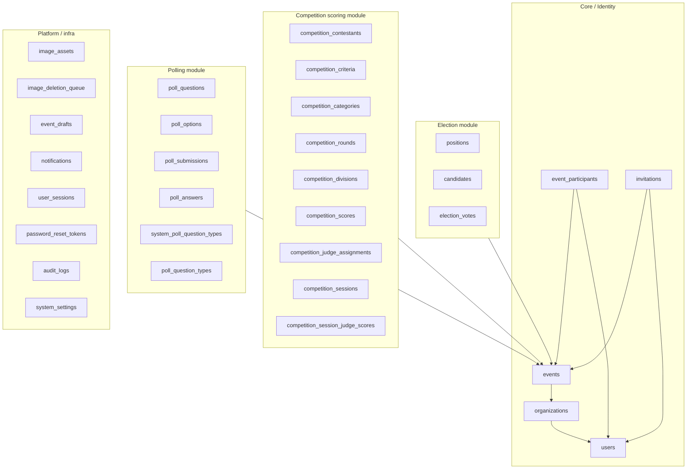
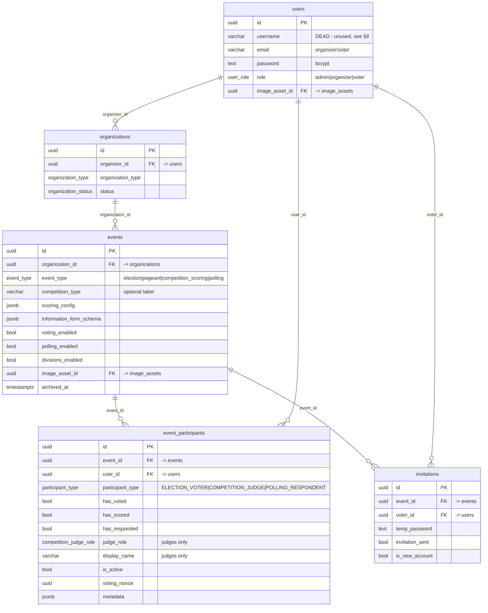
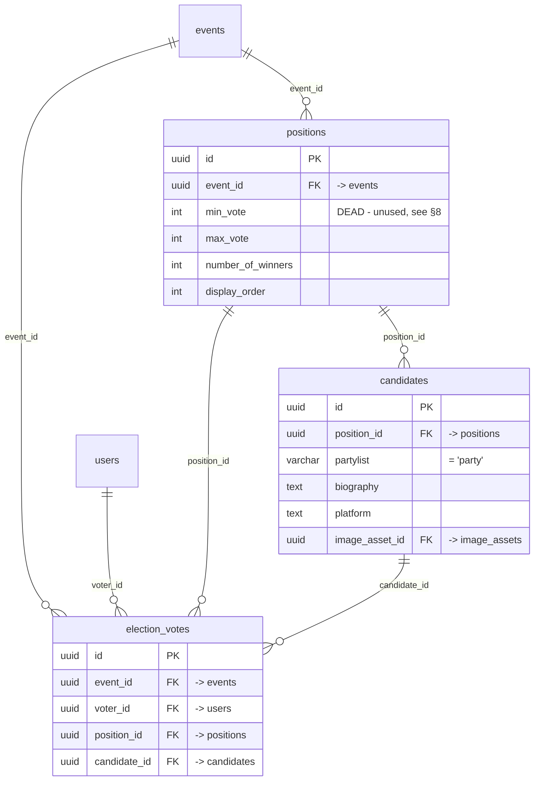
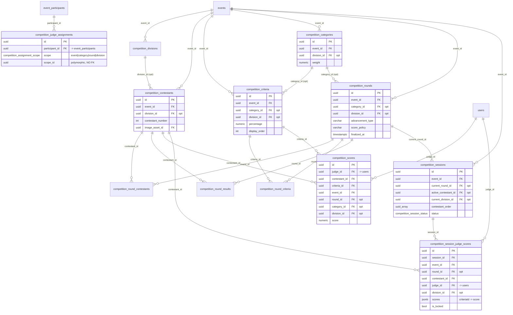
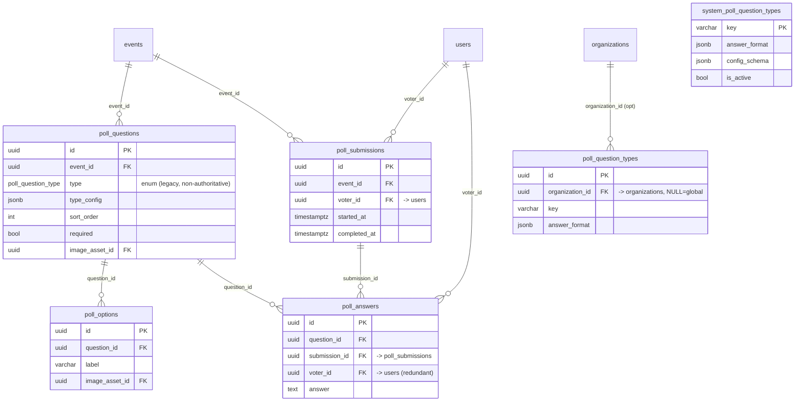

# Votrix — Current Database Schema (Live Tables Only)

> **Scope:** This document maps **only the tables the running application actually reads/writes today**, verified against `backend/src` code (`.from(...)`, the `DB_TABLES` registry in `utils/constants.js`, and the two `.rpc(...)` calls).
>
> **Deliberately excluded** (dead / legacy / superseded — see [§7](#7-legacy-not-in-the-diagrams)):
> `event_voters`, the `competition_judges` **table** (now a view), and the backward‑compat views `contestants`, `criteria`, `judge_scores`, `v_event_voters`, `v_legacy_competition_judges`.
>
> **Dead *columns* inside the live tables** (present but unused by the app) are catalogued separately in [§8](#8-unused--vestigial-columns-dead-columns) — e.g. `positions.min_vote`, `users.username`.
>
> Source of truth: migrations `001` → `067`. Diagrams render on GitHub / any Mermaid viewer.

---

## 1. Module map (high level)

**One `events` table backs all three modules.** Each module hangs its own tables off `events.id`, and enrollment for every module funnels through the single `event_participants` table (distinguished by `participant_type`).

---

## 2. Core / Identity

`event_participants` is the **canonical enrollment table** — it replaced `event_voters` (migration 029) and absorbed the old `competition_judges` table (migration 041). Voter, judge, and respondent are all the same row shape, keyed by `participant_type`.

---

## 3. Election module

**Write path:** the `cast_election_ballot(event_id, voter_id, votes)` RPC (migration 059) flips `event_participants.has_voted` **and** inserts `election_votes` rows atomically in one transaction.

> ⚠️ `election_votes.voter_id` points at **`users`**, not `event_participants` — see [§6, issue D](#issue-d--judge--voter-identity-is-not-anchored-to-event_participants).

---

## 4. Competition scoring module

Notes:
- **Divisions are optional** (`events.divisions_enabled`). Every `division_id` is nullable; `NULL` = event‑wide. A DB trigger enforces that a division belongs to the same event.
- **Junction tables** `competition_round_contestants` and `competition_round_criteria` wire many‑to‑many contestant↔round and criteria↔round.
- **`v_competition_active_session`** (a used view) joins `competition_sessions` → round + contestant for the live judge screen.
- Two score stores coexist (`competition_scores` and `competition_session_judge_scores`) — see [§6, issue A](#issue-a--two-parallel-score-stores).

---

## 5. Polling module

**Write path:** the `cast_poll_response(...)` RPC (migration 060) flips `event_participants.has_responded`, inserts one `poll_submissions` row, and inserts all `poll_answers` rows — atomically.

**Question types:** `system_poll_question_types` (built‑ins) + `poll_question_types` (per‑org overrides) are unioned by view **`v_poll_question_types`**, which the engine reads. The old `poll_questions.type` **enum is kept but is no longer authoritative** — see [§6, issue C](#issue-c--question-type-defined-in-two-competing-places).

---

## 6. Problems, duplication & connection risks

These are the issues visible in the *current* schema — the reason you asked for this map.

### Issue A — Two parallel score stores
`competition_scores` (one relational row per **judge × contestant × criteria**, with `score`) and `competition_session_judge_scores` (one **JSONB blob** per session × round × contestant, `scores = {criteriaId: value}`) hold the *same* scoring data in two different shapes. Live sessions write the JSONB table; reports/rankings read `competition_scores`. Any path that doesn't sync both leaves rankings and the live board disagreeing. **Decide which is canonical and derive the other.**

### Issue B — `invitations` overlaps `event_participants`
Both `(event_id, voter_id/user_id)` describe "this user belongs to this event." Migration 040 has to *reconcile* invitations back into `event_participants`, which is a symptom: enrollment truth is split across two tables. `invitations` should be strictly about the invite email/temp password, not a second membership record.

### Issue C — Question type defined in two competing places
`poll_questions.type` is a Postgres **enum**, but migration 017 declares the enum "no longer authoritative" and moves truth to `system_poll_question_types` / `poll_question_types` (via `v_poll_question_types`). Enum values can't be dropped, so the two definitions will drift. **Treat the enum as a legacy display hint only, or migrate `type` to a plain `varchar key` referencing the registry.**

### Issue D — Judge / voter identity is not anchored to `event_participants`
Enrollment and assignment use `event_participants.id` (`competition_judge_assignments.participant_id`), but **both** score tables and `election_votes`/`poll_submissions` reference `users.id` directly (`judge_id`, `voter_id`). Nothing at the DB level guarantees a score/vote's user is actually an enrolled participant of that event. A judge is currently representable three ways: an `event_participants` row, the `competition_judges` **view**, and a raw `users` FK in the score tables. **Consider FKs to `event_participants` (or a composite `(event_id, user_id)` check) on the scoring/vote tables.**

### Issue E — `competition_judge_assignments.scope_id` is a polymorphic UUID with no FK
`scope_id` points at an event, category, round, **or** division depending on `scope`, so it can't have a foreign key. Referential integrity is app‑enforced only; an orphaned `scope_id` won't be caught by the database.

### Issue F — `poll_answers.voter_id` is redundant (and an anonymity leak)
`poll_answers` already reaches the respondent through `submission_id → poll_submissions.voter_id`. The extra `voter_id` column duplicates that and **defeats `events.poll_anonymous`**, since each answer row still carries the user id. Drop it, or null it for anonymous polls.

### Issue G — `events` is a very wide single-table-inheritance blob
One `events` row carries election flags (`voting_enabled`, `results_visibility`), polling flags (`polling_enabled`, `poll_anonymous`, `poll_allow_multiple_submissions`, `poll_expires_at`), and competition config (`scoring_config`, `divisions_enabled`, `competition_type`) — most of them irrelevant/NULL for any given event type. Not a bug, but the main source of "columns that don't apply here." Watch for it when adding module fields.

---

## 7. Legacy (NOT in the diagrams)

Kept in the database for backward compatibility but **not used by current application code** — safe candidates for cleanup once you confirm no external reporting depends on them:

| Object | Kind | Replaced by | Evidence it's dead |
|---|---|---|---|
| `event_voters` | table | `event_participants` | Only a code *comment* references it; all reads/writes go to `event_participants`. |
| `competition_judges` | **view** (table renamed to `competition_judges_legacy` in 041) | `event_participants` (`participant_type = COMPETITION_JUDGE`) | Read‑only compat view; app writes to `event_participants`. |
| `competition_judges_legacy` | table | — | Renamed‑away original; retained only so the view name was free. |
| `contestants`, `criteria`, `judge_scores` | views | `competition_contestants`, `competition_criteria`, `competition_scores` | No `.from()` in code hits these bare names. |
| `v_event_voters`, `v_legacy_competition_judges` | views | `event_participants` | Compatibility shims from migrations 011/015/029/040. |
| `DB_TABLES.COMPETITION_JUDGES` | constant | — | Declared in `utils/constants.js` but never used — stale registry entry. |

> **Also note the rename churn:** the competition tables were renamed pageant → `competition_*` (011), and judges went first‑class‑table → unified‑into‑`event_participants` (041), and voters went `event_voters` → `event_participants` (029). Each step left a compatibility view behind. The *live* model is clean; the *leftover* views are the clutter.

### 7.1 Views explained — "working" ≠ "used"

A **view** is a saved `SELECT` query that behaves like a table when you read it, but **stores no data of its own** — it just re-reads a real table live. This trips people up, so two facts that are true *at the same time*:

- The `contestants` view **still works and shows your data.** It is literally defined `CREATE VIEW contestants AS SELECT * FROM competition_contestants`, so every contestant you add appears in it instantly. `SELECT count(*) FROM contestants` equals `SELECT count(*) FROM competition_contestants`.
- The `contestants` view is still **dead**, meaning **no application code reads or writes it.** The app talks to the real table `competition_contestants` directly. You seeing rows in the view is the *mirror* working — not the app using it.

> **Analogy:** a backward-compat view is an **old phone number that still forwards to your new number.** Dial the old number and your phone still rings (it works) — but nobody dials it anymore because everyone has the new number (it's unused). "Dead" here means *unused*, not *disconnected*.

**Why this matters for cleanup:** dropping a dead view **deletes zero data** — the rows live in the real table the view points at. `DROP VIEW contestants` removes only the old alias; `competition_contestants` and every contestant in it are untouched. The only risk is an *external* consumer (a Supabase saved query, a BI dashboard, an export script) that still reads the old name — your app doesn't.

**Not every view is dead.** The database has two kinds of views, and only one kind is clutter:

| View | Kind | Used by the app? | In the live map? |
|---|---|---|---|
| `contestants`, `criteria`, `judge_scores` | backward-compat shim (rename leftovers) | ❌ dead (label strings only) | excluded |
| `v_event_voters`, `v_legacy_competition_judges` | backward-compat shim | ❌ dead | excluded |
| `competition_judges` | backward-compat shim (over `event_participants`) | ❌ dead (only a stale `DB_TABLES` constant) | excluded |
| **`v_competition_active_session`** | **functional helper** (joins live session → round + contestant) | ✅ **alive** — the live judge screen reads it | **included** |
| **`v_poll_question_types`** | **functional helper** (unions built-in + custom types) | ✅ **alive** — the polling engine reads it | **included** |

So the six backward-compat shims are dead; the two functional helper views are alive and stay in the schema. *Working* is not the test — *used by the application* is.

---

## 8. Unused / vestigial columns (dead columns)

These columns **exist in the live tables above** but the running application never meaningfully reads or writes them (verified against `backend/src` and `frontend/src`, excluding migrations, tests, and one-off scripts). Dropping any of them would not change app behaviour — but confirm no external report/export depends on them first, exactly like the dead views in [§7](#7-legacy-not-in-the-diagrams).

### 8.1 Fully dead — zero application references

| Column | Table | Added by | Why it's dead / replaced by |
|---|---|---|---|
| `min_vote` | `positions` | 001 | Never read in code. Only the DB `CHECK (min_vote >= 0 …)` constraint uses it. The ballot UI enforces limits with `max_vote` + `allow_skip` + `number_of_winners`. |
| `is_judge` | `event_participants` | 005 (on old `event_voters`) | Superseded by `participant_type = 'COMPETITION_JUDGE'` + `judge_role`. The one code hit (`pageant.service.js`) *synthesises* an `is_judge: true` output field — it never reads the column. |
| `participant_info_fields` | `events` | 030 | Zero references. Superseded by `information_form_schema` (the JSONB form config the app actually uses). |
| `email_status` | `invitations` | 032 | Email-delivery tracking that was never wired up. No reads or writes in code. |
| `email_delivered_at` | `invitations` | 032 | Same — email tracking never implemented. |
| `email_bounced_at` | `invitations` | 032 | Same — email tracking never implemented. |

### 8.2 Vestigial — present but never populated / queried

| Column | Table | Added by | Status |
|---|---|---|---|
| `username` | `users` | 001 | No code path queries by username — `findUserByUsername()` exists but has **no callers**, and no app code ever assigns a username (admin rows are inserted via the SQL seed). `token.service` / `userMapper` only pass the value through, emitting `null` for every real account. Kept for the admin-login concept, but unused by the live app. |
| `temp_password` | `invitations` | 001 | Only ever written as `null` (two spots in `invitation.service.js`); never populated with a real value and never read. The "show temp password" flow is not active. |

### 8.3 Transitional — superseded but still read as a fallback (not fully dead)

| Column | Table | Note |
|---|---|---|
| `image_url` | `poll_questions`, `poll_options` | Superseded by `image_asset_id` (migration 037). Still **read** as a fallback in `polling.service.js` and consumed by the `migrate_existing_images.js` backfill script, so it is *not* safe to drop until every row's image has been migrated to `image_asset_id`. |

> **How this was verified:** each candidate column name was grepped across `backend/src` and `frontend/src` (excluding `database/migrations/`, `__tests__`, and standalone scripts). "Dead" = the column name never appears as a `.select(...)` field, insert/update key, `.eq()`/filter, or mapped response property anywhere the app runs.

---

## 9. Quick reference — the 30 live tables

**Core (5):** `users`, `organizations`, `events`, `event_participants`, `invitations`
**Election (3):** `positions`, `candidates`, `election_votes`
**Competition (12):** `competition_contestants`, `competition_criteria`, `competition_categories`, `competition_rounds`, `competition_divisions`, `competition_round_contestants`, `competition_round_criteria`, `competition_round_results`, `competition_scores`, `competition_judge_assignments`, `competition_sessions`, `competition_session_judge_scores`
**Polling (6):** `poll_questions`, `poll_options`, `poll_submissions`, `poll_answers`, `system_poll_question_types`, `poll_question_types`
**Platform (8):** `image_assets`, `image_deletion_queue`, `event_drafts`, `notifications`, `user_sessions`, `password_reset_tokens`, `audit_logs`, `system_settings`

**Used views:** `v_competition_active_session`, `v_poll_question_types`
**RPC (write) functions:** `cast_election_ballot`, `cast_poll_response`
