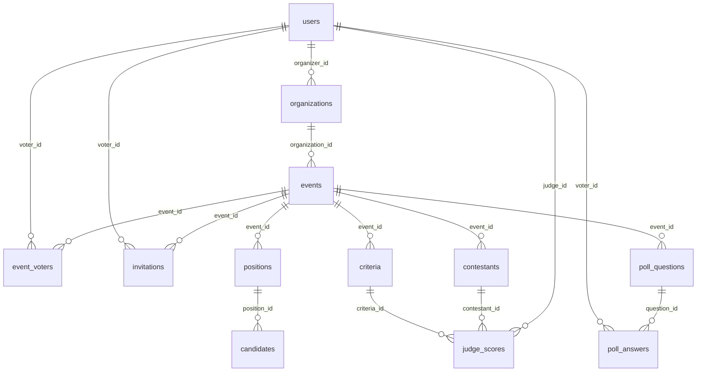

# VOTRIX Database (Phase 2)

PostgreSQL schema for Supabase. All primary keys are **UUID** (`gen_random_uuid()`).

## Apply migrations

1. Open [Supabase Dashboard](https://supabase.com/dashboard) → your project → **SQL Editor**.
2. Paste and run `migrations/001_initial_schema.sql`.
3. (Optional) To reset: run `migrations/002_down_initial_schema.sql`, then re-run `001`.

## Entity relationship



## Tables

| Table | Purpose |
|-------|---------|
| `users` | Admin, organizer, voter accounts |
| `organizations` | Organizer-owned org (election / pageant / polling) |
| `events` | Event under an organization |
| `event_voters` | Voter enrollment + `has_voted` |
| `invitations` | Invite + temp password + sent flag |
| `positions` | Election ballot positions |
| `candidates` | Election candidates |
| `contestants` | Pageant contestants |
| `criteria` | Pageant scoring rubric |
| `judge_scores` | Judge scores per contestant per criterion |
| `poll_questions` | Polling questions |
| `poll_answers` | Voter answers |

## `users`

| Column | Type | Notes |
|--------|------|--------|
| `id` | UUID | PK |
| `username` | VARCHAR(64) | Required for **admin**; unique |
| `email` | VARCHAR(255) | Required for **organizer** / **voter**; unique |
| `password` | TEXT | **Bcrypt hash** (never plaintext) |
| `role` | `user_role` | `admin`, `organizer`, `voter` |
| `must_change_password` | BOOLEAN | Default `false` |
| `created_at` | TIMESTAMPTZ | |
| `updated_at` | TIMESTAMPTZ | Auto-updated |

**Auth rules**

- **Admin:** `username` + `password` — insert manually only (no frontend registration).
- **Organizer / voter:** `email` + `password`.

## Enums

| Type | Values |
|------|--------|
| `user_role` | `admin`, `organizer`, `voter` |
| `organization_type` | `election`, `pageant`, `polling` |
| `organization_status` | `draft`, `active`, `inactive`, `archived` |
| `event_status` | `draft`, `scheduled`, `active`, `completed`, `cancelled` |
| `event_type` | `election`, `pageant`, `polling` |
| `poll_question_type` | `single_choice`, `multiple_choice`, `text`, `rating` |

## Create admin manually

```bash
cd backend
npm run db:hash-password -- "YourSecurePassword"
```

Copy the hash into `seeds/001_admin_user.example.sql`, then run that SQL in Supabase.

## Design notes

- **Cascade deletes:** Removing an `organization` deletes its `events` and dependent rows.
- **Uniqueness:** One voter per event (`event_voters`, `invitations`); one answer per voter per question (`poll_answers`); one score per judge/contestant/criterion (`judge_scores`).
- **Judges:** `judge_scores.judge_id` → `users.id` (assignment handled in application layer in later phases).
- **RLS:** Not enabled in Phase 2; API uses service role. Add Row Level Security in a later phase if needed.
