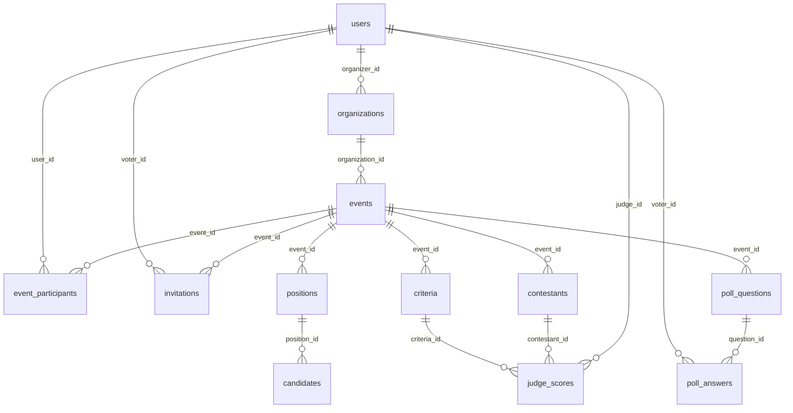

# VOTRIX Database

PostgreSQL schema for Supabase. All primary keys are **UUID** (`gen_random_uuid()`).

## Apply migrations

1. Open [Supabase Dashboard](https://supabase.com/dashboard) → your project → **SQL Editor**.
2. Apply every forward migration in numeric order through the latest file.
   Files prefixed with `*_down_*` are rollback scripts and must not be applied
   during a forward migration. When multiple forward files share a number,
   apply them in filename order before moving to the next number.
3. Migration `029_event_participant_roles.sql` introduces
   `event_participants` as the canonical enrollment table.
4. Migration `033_fix_voter_registration_participants.sql` reconciles legacy
   enrollment and adds voting nonces to the canonical table.
5. Migration `040_reconcile_event_participants.sql` performs the final repair,
   including judges that existed only in `competition_judges`. Apply it before
   deploying application code that no longer reads `event_voters`.
6. Roll back only with the down migration matching the specific forward
   migration. `040_down_reconcile_event_participants.sql` removes the indexes
   added by `040` and restores the migration `033` compatibility view, but
   intentionally retains repaired participant rows to prevent enrollment loss.

## Entity relationship


```mermaid
erDiagram
  users ||--o{ organizations : "organizer_id"
  organizations ||--o{ events : "organization_id"
  events ||--o{ event_participants : "event_id"
  events ||--o{ invitations : "event_id"
  users ||--o{ event_participants : "user_id"
  users ||--o{ invitations : "voter_id"
  events ||--o{ positions : "event_id"
  positions ||--o{ candidates : "position_id"
  events ||--o{ contestants : "event_id"
  events ||--o{ criteria : "event_id"
  users ||--o{ judge_scores : "judge_id"
  contestants ||--o{ judge_scores : "contestant_id"
  criteria ||--o{ judge_scores : "criteria_id"
  events ||--o{ poll_questions : "event_id"
  poll_questions ||--o{ poll_answers : "question_id"
  users ||--o{ poll_answers : "voter_id"
```

## Tables

| Table | Purpose |
|-------|---------|
| `users` | Admin, organizer, voter accounts |
| `organizations` | Organizer-owned org (election / pageant / polling) |
| `events` | Event under an organization |
| `event_participants` | Canonical voter, judge, and respondent enrollment |
| `event_voters` | Legacy physical table retained only for migration compatibility |
| `v_event_voters` | Read-only compatibility view over `event_participants` |
| `invitations` | Invite + temp password + sent flag |
| `positions` | Election ballot positions |
| `candidates` | Election candidates |
| `contestants` | Pageant contestants |
| `criteria` | Pageant scoring rubric |
| `judge_scores` | Judge scores per contestant per criterion |
| `poll_questions` | Polling questions |
| `poll_answers` | Voter answers |

## `users`

| Column | Type | Notes |
|--------|------|--------|
| `id` | UUID | PK |
| `username` | VARCHAR(64) | Required for **admin**; unique |
| `email` | VARCHAR(255) | Required for **organizer** / **voter**; unique |
| `password` | TEXT | **Bcrypt hash** (never plaintext) |
| `role` | `user_role` | `admin`, `organizer`, `voter` |
| `must_change_password` | BOOLEAN | Default `false` |
| `created_at` | TIMESTAMPTZ | |
| `updated_at` | TIMESTAMPTZ | Auto-updated |

**Auth rules**

- **Admin:** `username` + `password` — insert manually only (no frontend registration).
- **Organizer / voter:** `email` + `password`.

## Enums

| Type | Values |
|------|--------|
| `user_role` | `admin`, `organizer`, `voter` |
| `organization_type` | `election`, `pageant`, `polling`, `competition_scoring` |
| `organization_status` | `draft`, `active`, `inactive`, `archived` |
| `event_status` | `draft`, `scheduled`, `active`, `completed`, `cancelled` |
| `event_type` | `election`, `pageant`, `polling`, `competition_scoring` |
| `poll_question_type` | `single_choice`, `multiple_choice`, `checkbox`, `yes_no`, `text`, `rating`, `likert_scale`, `open_text`, `ranking` |
| `user_account_status` | `pending`, `active`, `suspended`, `archived` |
| `election_results_visibility` | `real_time`, `hidden`, `public` |
| `competition_judge_role` | `judge`, `head_judge`, `score_reviewer` |
| `competition_assignment_scope` | `event`, `category`, `round` |

## Phase 9 — Indexes & optimization

`migrations/019_phase9_indexes_and_optimizations.sql` adds composite
indexes that match the hot read paths the service layer actually runs:

- `(event_id, has_voted)` and `(event_id, is_judge)` on `event_voters`
- `(event_id, candidate_id)` on `election_votes`
- `(criteria_id, round_id)` on `competition_scores`
- `(event_id, sort_order)` on `poll_questions`
- `(user_id, is_read, created_at DESC)` on `notifications`
- `(entity, entity_id, created_at DESC)` on `audit_logs`
- `(organizer_id, organization_type)` on `organizations`
- GIN on `events.scoring_config` for JSONB lookups

The migration also creates a `v_audit_log_with_user` view that joins
`audit_logs` to `users` so the activity feed endpoint can read a single
view instead of writing the join inline.

## Create admin manually

```bash
cd backend
npm run db:hash-password -- "YourSecurePassword"
```

Copy the hash into `seeds/001_admin_user.example.sql`, then run that SQL in Supabase.

## Design notes

- **Cascade deletes:** Removing an `organization` deletes its `events` and dependent rows.
- **Uniqueness:** One participant role per user and event (`event_participants`), one invitation per user and event (`invitations`), one answer per voter and question (`poll_answers`), and one score per judge/contestant/criterion (`judge_scores`).
- **Judges:** `judge_scores.judge_id` → `users.id` (assignment handled in application layer in later phases).
- **RLS:** Not enabled in Phase 2; API uses service role. Add Row Level Security in a later phase if needed.
