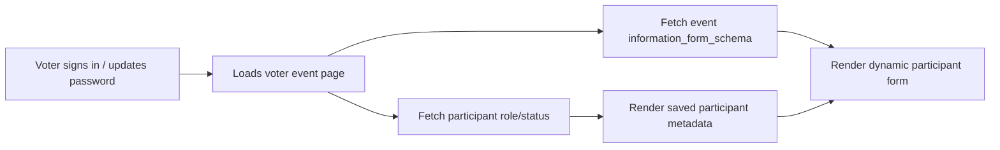

# Participant Information Form Missing After Voter Login

## Problem Statement

In **Election**, **Competition**, and **Polling**, the participant information form does not appear for voters after they sign in and complete a password update.

The backend already stores the organizer-defined form schema on the **event record** as `information_form_schema`, but the voter-facing page is trying to render the form from `participantInfo.metadata._formFields` instead. That metadata belongs to the participant row and is usually empty on first load, so the form never renders even when the event has a configured information form.

This is a data-source mismatch, not a password-auth failure.

---

## Root Cause Analysis

### 1. The voter page reads the wrong source for form fields

`frontend/src/pages/voter/VoterEventPage.jsx` fetches:

- `voterService.getMyEventRole(eventId)`

It then renders the form only when `participantInfo` exists and passes:

- `fields={participantInfo.metadata?._formFields}`

That means the UI expects the participant row to already contain the form definition.

But the schema is actually stored on the event record, not on the participant row.

### 2. The backend returns participant status, not the event schema

`backend/src/controllers/voter.controller.js` returns:

- `participantType`
- `hasVoted` / `hasScored` / `hasResponded`
- `metadata`

It does **not** return the event’s `information_form_schema`.

### 3. Organizer APIs already prove the schema exists on the event

The organizer services for election, competition, and polling all load:

- `event.information_form_schema`

So the schema exists and is already the canonical source of truth.

### 4. Password change only exposes the bug earlier in the flow

After a voter updates their password, the app navigates them back into the authenticated area. When they later open an event page, the page still depends on participant metadata instead of the event schema, so the form section stays hidden.

---

## Impact Matrix

| Module      | Current Behavior                                                                      | Impact                                                       |
| ----------- | ------------------------------------------------------------------------------------- | ------------------------------------------------------------ |
| Election    | Participant form section never appears unless metadata already contains `_formFields` | Voters cannot see or fill extra profile fields before voting |
| Competition | Same hidden-form behavior on judge/scoring page flow                                  | Judges miss required participant fields                      |
| Polling     | Same hidden-form behavior on poll page flow                                           | Respondents miss required participant fields                 |

---

## Implementation Plan

### Backend changes

#### 1. Expose the event information form in a voter-facing endpoint

Update `backend/src/controllers/voter.controller.js` so the event-role response also includes the event’s `information_form_schema`, or add a dedicated endpoint such as:

- `GET /voter/events/:eventId/information-form`

The response should return:

- `success`
- `participantType`
- `hasVoted` / `hasScored` / `hasResponded`
- `metadata`
- `informationFormSchema`

The form schema should come from `events.information_form_schema`, not from participant metadata.

#### 2. Keep participant metadata for saved user input only

Leave `participant.metadata` as the storage location for submitted answers, but do not use it as the schema source.

#### 3. Make the voter endpoint consistent across modules

Ensure the voter-facing data returned for election, competition, and polling all follows the same shape so the UI can render the form the same way everywhere.

---

### Frontend changes

#### 4. Update `VoterEventPage.jsx` to fetch the schema from the event source

Replace the current `participantInfo.metadata?._formFields` dependency with the event schema returned by the voter API.

The page should:

- fetch participant status
- fetch `informationFormSchema`
- render `ParticipantInformationForm` only when `informationFormSchema.enabled` is true and `fields.length > 0`

#### 5. Pass schema fields directly to `ParticipantInformationForm`

Feed the form builder fields from the event schema, not from participant metadata.

Suggested prop shape:

- `initialMetadata={participantInfo.metadata}` for saved responses
- `fields={informationFormSchema.fields}` for the schema

#### 6. Add loading and empty-state handling

If the schema is still loading, show a small loading state.

If the form is disabled or has no fields, hide the block entirely.

---

## Recommended Data Flow

---

## Files to Change

| File                                                           | Change                                                                 |
| -------------------------------------------------------------- | ---------------------------------------------------------------------- |
| `backend/src/controllers/voter.controller.js`                  | Return or expose `informationFormSchema` for the voter event view      |
| `backend/src/services/event.service.js`                        | Optional helper if the schema fetch should be centralized              |
| `frontend/src/pages/voter/VoterEventPage.jsx`                  | Fetch and render from the event schema instead of participant metadata |
| `frontend/src/components/voter/ParticipantInformationForm.jsx` | Keep as the render/save component; no schema ownership change needed   |

---

## Verification Steps

1. Sign in as a voter who belongs to an event with an enabled information form.
2. Update the password and return to the authenticated area.
3. Open an election event page and confirm the participant form appears.
4. Repeat for competition and polling event pages.
5. Confirm the form stays hidden when `information_form_schema.enabled` is false or the fields array is empty.
6. Confirm saved participant answers still persist in participant metadata.

---

## Notes

- The password update flow is not the root cause.
- The root issue is that the UI is reading schema data from the wrong place.
- Fixing the data contract in the voter event page should resolve the missing form across all three modules.
