# CHAPTER III — METHODOLOGY (VOTRIX)

> **Working document — derived from the actual VOTRIX implementation.**
> This expansion of Chapter III was reconstructed directly from the VOTRIX
> source code (backend Express controllers/services, PostgreSQL migrations, the
> scoring engine, and the React front end), not from a generic template. Every
> table, endpoint, rule, and formula cited below was verified against the
> repository. Where the manuscript claims a behavior that the code does not
> confirm, it is flagged as **"Not confirmed from the available system
> information."**
>
> **How to use this file.** All diagrams are written in **Mermaid** so they
> render live in GitHub, VS Code (Mermaid preview), Obsidian, Typora, and most
> Markdown viewers. To place a figure in the Word manuscript, open the diagram
> in a Mermaid renderer (e.g. <https://mermaid.live>), export it as PNG/SVG, and
> insert it under the matching figure caption. Figure numbers here follow the
> continuous scheme proposed in **§13 (Figure Numbering)**.

---

## Table of Contents

- **§1 — System Study: Actors / Roles Inventory**
- **§2 — System Study: Module Inventory**
- **§3 — Technology Stack & System Architecture (verified)**
- **§4 — Complete Function Inventory (master tables, per module)**
- **§5 — 3.4 System Architecture (written + diagram)**
- **§6 — 3.6 Database Schema (written + ER diagram)**
- **§7 — 3.7 Use Case Diagrams (per operation)**
- **§8 — 3.8 Activity Diagrams (per operation)**
- **§9 — 3.9 Sequence Diagrams (per operation)**
- **§10 — Deep Dive: Voting**
- **§11 — Deep Dive: Competition Scoring**
- **§12 — 3.10 System Previews (screenshot inventory)**
- **§13 — Figure Numbering Scheme**
- **§14 — Missing System Documentation (gap analysis vs. current manuscript)**
- **§15 — Unnecessary / Outdated / Duplicate Diagrams**
- **§16 — Recommended Chapter III Structure**
- **§17 — Final Update Checklist**

---

# §1 — System Study: Actors / Roles Inventory

VOTRIX implements exactly **three system-level user roles**, defined in
`backend/src/utils/constants.js` as the `user_role` enum
(`admin`, `organizer`, `voter`) and enforced by the `authorize()` middleware in
`backend/src/middleware/auth.js`.

A crucial architectural fact the manuscript already states correctly and which
drives all downstream diagrams: **the election voter, the competition judge, and
the polling respondent are NOT separate accounts.** They are all `voter`
accounts. Their *event-specific* capability is decided by a **participant type**
stored per event in the `event_participants` table
(`participant_type ∈ {ELECTION_VOTER, COMPETITION_JUDGE, POLLING_RESPONDENT}`,
migration `029_event_participant_roles.sql`). The `requireEventParticipant(type)`
middleware enforces this per request.

Therefore VOTRIX has **3 authentication actors** and **3 additional
participation sub-actors** (event-scoped), for **6 effective actors** in the use
case model — which is exactly how the current manuscript groups Figures 4–9.

## 1.1 Actor: Administrator (`admin`)

- **Authentication:** logs in with **username + password** (admins have no email;
  enforced by `users_admin_has_username` / `users_non_admin_has_email` CHECK
  constraints). Seeded manually (`seeds/001_admin_user.example.sql`).
- **Access:** every route under `/api/admin/*` (guarded by
  `authenticate → authorize(ADMIN) → requirePasswordChanged`).
- **Can create:** organizer accounts (auto-generated password, emailed).
- **Can edit:** system settings, alert configuration, archival policy.
- **Can deactivate:** organizer accounts (status → `active`/`suspended`/`archived`).
- **Can view:** admin dashboard & analytics, all organizers, per-organizer
  activity, **global events across all organizers**, audit logs, system health,
  active user sessions, platform search.
- **Can revoke:** an individual session, or *all* sessions for a user (forced
  logout via token-version bump).
- **Can export:** organizers, events, and audit logs (CSV/data export).
- **Restrictions:** admins do not create or run election/competition/polling
  events themselves — that is the organizer's domain. There is no "delete user"
  endpoint; deactivation is via `account_status`. **Approval workflow for
  organizer-created events is *not confirmed*** (no approve/reject endpoints exist;
  organizers self-publish).

## 1.2 Actor: Organizer (`organizer`)

- **Authentication:** email + password. Account is created by the admin with
  `must_change_password = true`; first login forces a password change, then a
  **profile-completion (onboarding)** gate.
- **Onboarding gate:** `requireProfileComplete` blocks all module routes until the
  organizer fills `organization_name`, `organization_type_display`,
  `organizer_name`, and `position` (see `auth.js`).
- **Can create:** election events, competition-scoring events, polling events,
  and everything inside them (positions, candidates, contestants, criteria, minor
  criteria, categories, rounds, divisions, judges, judge assignments, poll
  questions, custom poll question types, participant information forms, drafts).
- **Can edit / delete:** all of the above they own. Deletion of a position or
  candidate is **blocked once votes exist** (HTTP 409) — a real integrity guard.
- **Can manage participants:** register voters/judges/respondents (individually,
  "register existing", or **CSV import** with a preview step), send invitations
  (single or send-all), resend invitations, and send event notifications (email).
- **Can operate live:** start/pause/resume/complete a **live competition
  session**, navigate contestants/rounds, finalize rounds and advance contestants.
- **Can publish / finalize:** publish an event (releases draft → scheduled),
  finalize an election.
- **Can view:** own dashboards, per-event analytics, voting timelines, rankings,
  results, ballot previews, reports (election/competition/polling).
- **Restrictions:** an organizer may only act on events under their own
  organization — every service call passes through `assertOrganizerOwnsEvent()`.
  Per migration `028`, **one organization per organizer**. An organizer cannot see
  other organizers' data or admin functions.

## 1.3 Actor: Voter (`voter`) — account level

- **Authentication:** email + password (temp password on first invite;
  `must_change_password` then forces a change, or the voter may **skip** and keep
  the temporary password — `skipPasswordChange`).
- **Account-level abilities:** view own overview/dashboard, get a role-aware
  login redirect, list their participant types across events, view/edit their own
  **participant information** for an event (`updateMyParticipantInformation`),
  change password, request/complete password reset, receive notifications.
- **Restriction:** at the account level a voter can do nothing to an event until
  they are enrolled as a participant of a specific type.

### 1.3.1 Sub-actor: Election Voter (`participant_type = ELECTION_VOTER`)
Views assigned elections, opens a ballot, casts a vote (once), and views results
when the organizer's `results_visibility` policy allows.

### 1.3.2 Sub-actor: Competition Judge (`participant_type = COMPETITION_JUDGE`)
Views assigned competitions, opens a scoring sheet (restricted to assigned
divisions/rounds/categories), submits scores (once, locked), and — in a live
session — sees the organizer-controlled active round/contestant and submits
per-criterion scores. A judge whose sub-role is `score_reviewer` is **read-only**.

### 1.3.3 Sub-actor: Polling Respondent (`participant_type = POLLING_RESPONDENT`)
Views assigned polls, answers the questions, and submits — once, unless the
organizer enabled `poll_allow_multiple_submissions`.

## 1.4 Role / Permission Matrix (verified against routes)

| Capability | Admin | Organizer | Voter (account) | Election Voter | Judge | Respondent |
|---|:---:|:---:|:---:|:---:|:---:|:---:|
| Log in / out, change password | ✅ | ✅ | ✅ | ✅ | ✅ | ✅ |
| Forgot / reset password | ✅ | ✅ | ✅ | — | — | — |
| Create organizer accounts | ✅ | — | — | — | — | — |
| Suspend/archive organizers | ✅ | — | — | — | — | — |
| System settings / alerts / archival | ✅ | — | — | — | — | — |
| View audit logs (platform) | ✅ | — | — | — | — | — |
| Session management (revoke) | ✅ | — | — | — | — | — |
| View global events (all orgs) | ✅ | — | — | — | — | — |
| Complete organizer profile | — | ✅ | — | — | — | — |
| Create/edit/delete events | — | ✅ | — | — | — | — |
| Manage positions & candidates | — | ✅ | — | — | — | — |
| Manage contestants/criteria/rounds/categories/divisions | — | ✅ | — | — | — | — |
| Invite/register participants (+CSV) | — | ✅ | — | — | — | — |
| Judge invite & assignment scopes | — | ✅ | — | — | — | — |
| Live session control | — | ✅ | — | — | — | — |
| Publish / finalize event | — | ✅ | — | — | — | — |
| View analytics / rankings / reports | — | ✅ (own) | — | — | — | — |
| Cast an election vote | — | — | — | ✅ | — | — |
| Submit competition scores | — | — | — | — | ✅ | — |
| Submit a poll response | — | — | — | — | — | ✅ |
| Edit own participant information | — | — | ✅ | ✅ | ✅ | ✅ |
| Receive in-app notifications | ✅ | ✅ | ✅ | ✅ | ✅ | ✅ |

---

# §2 — System Study: Module Inventory

The proposed generic module list from the brief was compared against the actual
codebase. The table below marks each as **present**, **merged into another
module**, or **not present**, with the evidence.

| # | Candidate module | Status in VOTRIX | Evidence |
|---|---|---|---|
| 1 | Authentication & Account Mgmt | ✅ Present | `auth.routes.js`, `auth.controller.js`, JWT + cookies, CSRF |
| 2 | Election | ✅ Present | `election-organizer.routes.js`, `election.service.js` |
| 3 | Voting (election ballot) | ✅ Present | `election-voter.routes.js`, `cast_election_ballot` RPC |
| 4 | Polling | ✅ Present | `polling-organizer.routes.js`, `polling-voter.routes.js` |
| 5 | Competition Scoring | ✅ Present | `pageant-*`, `competition-*` routes, `scoring-engine.js` |
| 6 | Competition Types | ✅ Present | `057_competition_type.sql`, `competition-templates.js` |
| 7 | Competitions / Events | ✅ Present | `events` table + per-module event routes |
| 8 | Contestants | ✅ Present | `competition_contestants`, per-division numbering |
| 9 | Categories | ✅ Present | `competition_categories` (weighted) |
| 10 | Divisions | ✅ Present | `competition_divisions` (migration 038) |
| 11 | Rounds | ✅ Present | `competition_rounds` + round↔contestant/criteria maps |
| 12 | Criteria | ✅ Present | `competition_criteria` (percentage-weighted) |
| 13 | Minor Criteria | ✅ Present | `competition_minor_criteria` (migration 071) |
| 14 | Judges | ✅ Present | canonical `event_participants` + legacy `competition_judges` |
| 15 | Judge Assignments | ✅ Present | `competition_judge_assignments` (event/category/round/division scope) |
| 16 | Score Configuration | ✅ Present | `events.scoring_config` JSONB + `scoring-engine.js` |
| 17 | Scoring | ✅ Present | classic (`competition_scores`) + live-session scores |
| 18 | Live Competition Control | ✅ Present | `competition_sessions`, `competition-session.controller.js` |
| 19 | Rankings | ✅ Present | `computeRankings()` in `scoring-engine.js` |
| 20 | Results | ✅ Present | election/competition/polling result endpoints |
| 21 | Round Advancement | ✅ Present | `advancement.js`, `competition_round_results` (migration 058) |
| 22 | Awards | ✅ Present | `competition_awards`, `competition_award_selections` (066/067) |
| 23 | Reports | ✅ Present | `reports-organizer.routes.js`, `reports.service.js`, `export.service.js` |
| 24 | Audit Logs | ✅ Present | `audit_logs` table, `recordAudit()` / `recordEventActivity()` |
| 25 | Notifications | ✅ Present | `notifications` table, `notifications.routes.js`, WebSocket |
| 26 | User / Profile Information | ✅ Present | organizer profile, voter participant info |
| 27 | Participant Information Forms | ✅ Present | `information_form_schema` JSONB per event |
| 28 | Drafts (create-session autosave) | ✅ Present | `event_drafts` (migration 034), `draft.controller.js` |
| 29 | Image / Media Assets | ✅ Present | `image_assets` + deletion queue (Cloudinary) |
| 30 | Email service | ✅ Present | `email.service.js` / `mailer.service.js` (Resend) |
| 31 | Real-time (WebSocket) | ✅ Present | `backend/src/websocket/`, `ws-emitter.js` |
| 32 | System Health / Monitoring | ✅ Present | `health.routes.js`, `HealthDashboardPage.jsx` |
| 33 | Archival policy | ✅ Present | `archival.service.js`, admin archival endpoints |
| — | OTP / two-factor auth | ❌ **Not present** | no OTP code path found; the manuscript's "OTP" preview should be removed unless added |
| — | Open registration (self sign-up) | ❌ **Not present** | accounts are admin-created (organizers) or organizer-invited (voters) |

**Grouping used for diagrams (§7–§9):** Authentication, Administration,
Organizer–Election, Organizer–Competition, Organizer–Polling, Participation
(Voter/Judge/Respondent), and Cross-cutting (Notifications, Drafts, Reports).

---

# §3 — Technology Stack & System Architecture (verified)

Every technology below was confirmed in the repository; nothing is assumed.

| Tier | Technology | Evidence |
|---|---|---|
| Client | **React** single-page app (Vite build) | `frontend/src/`, `frontend/dist/assets` |
| API | **Node.js + Express** REST API | `backend/src/routes`, Express `Router` |
| Auth | **JWT access + refresh tokens in HTTP-only cookies**; token-version revocation | `middleware/auth.js`, `utils/jwt.js`, `utils/cookies.js` |
| CSRF | Double-submit CSRF token | `utils/csrf.js`, `/auth/csrf` |
| Password | **bcrypt** hashing; `must_change_password` flow | `users.password` (bcrypt), `hashPassword` |
| Rate limiting | Per-purpose limiters (auth, vote, poll, judge score, CSV, email, upload) | `middleware/rateLimiter.js` |
| Data | **PostgreSQL** (Supabase), UUID PKs, SQL migrations, PL/pgSQL RPCs | `database/migrations/*` |
| Media | **Cloudinary** image storage + async deletion queue | `imageAsset.service.js`, `upload.service.js` |
| Email | **Resend** (invitations, onboarding, notifications) | `mailer.service.js`, `email.service.js` |
| Real-time | **WebSocket** (live rankings, session state, dashboard stats) | `backend/src/websocket/`, `ws-emitter.js` |

**Request direction (all tiers):**
`User → React SPA → Express REST API → (auth/CSRF/rate-limit middleware) →
service layer → PostgreSQL / Cloudinary / Resend → service → API → SPA → User`,
with an out-of-band `API → WebSocket → SPA` push for live updates.

**Lifecycle model (verified).** Events are **schedule-driven**. `publishEvent`
only flips `draft → scheduled`; a schedule-sync service then reconciles
`scheduled / active / completed` purely from `start_date`/`end_date`. Voting,
scoring, and polling "openness" is derived from the schedule + the module's
enabled flag (`voting_enabled` / `scoring_enabled` / `polling_enabled`), not a
manual toggle (see `eventSchedule.js`, `event-schedule-sync.service.js`).

---

# §4 — Complete Function Inventory (master tables)

Legend for **DB action**: I = insert, U = update, D = delete, S = select,
RPC = PL/pgSQL transaction. All organizer writes also call `recordAudit()` /
`recordEventActivity()` (audit trail) unless noted.

## 4.1 Authentication & Account Management

| Function | Role | Endpoint | User action | System response / validation | DB action | Success | Error paths |
|---|---|---|---|---|---|---|---|
| Get CSRF token | any | `GET /auth/csrf` | app boot | issues CSRF cookie + token | — | token returned | — |
| Login | all | `POST /auth/login` | submit email/username + password | validate body; verify credentials (bcrypt); issue JWT access+refresh in cookies; audit `*_LOGIN_SUCCESS`/`LOGIN_FAILED` | S users; I audit | cookies set, `user` + csrf returned | invalid creds (401), inactive/suspended/archived (403), rate-limited (429) |
| Get current user | all | `GET /auth/me` | load session | returns sanitized profile | S | user | 401 |
| Change password | all | `POST /auth/change-password` | submit old+new | validate; bcrypt update; **re-issue session** (token-version bump); audit | U users | new session | weak/incorrect password (400) |
| Skip password change | voter | `POST /auth/skip-password-change` | choose "keep temp" | clears `must_change_password`; re-issue session | U users | session | 403 if not permitted |
| Forgot password | organizer/voter | `POST /auth/forgot-password` | submit email | create reset token; email link (Resend); **always returns generic success** (no user enumeration) | I `password_reset_tokens` | generic OK | rate-limited (429) |
| Reset password | organizer/voter | `POST /auth/reset-password` | submit token+new pw | validate token (unexpired, unused); bcrypt update; consume token | U users, U token | OK | invalid/expired token (400) |
| Refresh session | all | `POST /auth/refresh` | silent | verify refresh cookie + token version; re-issue | S | new cookies | missing/invalid refresh (401) |
| Logout | all | `POST /auth/logout` | click logout | audit `USER_LOGOUT`; **revoke session** (token-version bump); clear cookies | U users; I audit | cleared | — |
| Organizer onboarding | organizer | `PUT /organizer/profile` | fill org profile | validate 4 required fields; save; unblock modules | U users | profile complete | `PROFILE_INCOMPLETE` gate (403) until saved |

## 4.2 Administration

| Function | Endpoint | User action | System response / validation | DB | Success | Error |
|---|---|---|---|---|---|---|
| Dashboard / analytics | `GET /admin/dashboard`, `/analytics`, `/overview` | open | aggregate platform stats | S | metrics | 403 non-admin |
| List organizers | `GET /admin/organizers` | open | list + status | S | list | — |
| Create organizer | `POST /admin/organizers` | submit org email/name | **auto-generate password**, `must_change_password=true`, email credentials (Resend); audit | I users; I audit | account + email sent | duplicate email (409) |
| Organizer activity | `GET /admin/organizers/:id/activity` | open | per-organizer audit slice | S | activity | 404 |
| Update organizer status | `PATCH /admin/organizers/:id/status` | activate/suspend/archive | set `account_status`; audit | U users | status changed | invalid status (400) |
| Send onboarding | `POST /admin/organizers/:id/send-onboarding` | resend welcome | email onboarding notice | — | sent | 404 |
| Global events | `GET /admin/events` | open | events across all orgs | S | list | — |
| System settings | `GET/PUT /admin/settings` | edit config | validate; upsert JSONB | S/U `system_settings` | saved | 400 |
| Audit logs | `GET /admin/audit-logs` | browse | paginated, filterable | S `audit_logs` | logs | — |
| System health | `GET /admin/health` | open | DB/service checks | S | health | — |
| Alert config | `GET/PUT /admin/alerts/config` | edit thresholds | validate; save | S/U | saved | 400 |
| Sessions list / revoke | `GET /admin/sessions`, `DELETE /admin/sessions/:id`, `DELETE /admin/users/:id/sessions` | revoke | delete session row / bump token-version (force logout) | S/D/U | revoked | 404 |
| Platform search | `GET /admin/search` | query | cross-entity search | S | results | — |
| Archival policy | `GET/PUT /admin/policies/archival`, `POST .../run-now` | configure/run | validate policy; run archival job | S/U/RPC | applied | 400 |
| Export data | `GET /admin/export/{organizers,events,audit-logs}` | download | generate CSV/data | S | file | — |

## 4.3 Organizer — Election

| Function | Endpoint | Action | System response / validation | DB | Success | Error |
|---|---|---|---|---|---|---|
| Dashboard | `GET /organizer/election/dashboard` | open | cached (30s) stats: events, turnout | S | stats | 500 |
| List / get event | `GET .../events`, `.../events/:id` | browse | own-org scoped | S | data | 404 |
| Create event | `POST .../events` | submit | create election event (draft, `voting_enabled=false`); clear draft; audit | I events | event | 400/500 |
| Update event | `PATCH .../events/:id` | edit | date order check; lifecycle guard; banner asset cleanup | U events | event | 400 date, 409 lifecycle |
| Upload banner | `POST .../events/:id/banner` | upload | Cloudinary; asset record | I image | url | 400 type/size |
| Positions CRUD | `.../positions[...]` | add/edit/del | delete **blocked if votes exist (409)** | I/U/D positions | ok | 409 has-votes |
| Candidates CRUD | `.../candidates[...]` | add/edit/del | must belong to position/event; delete blocked if votes exist | I/U/D candidates | ok | 404/409 |
| Register voter | `POST .../voters/register` | add voter | create account + temp pw + `must_change_password`; enroll participant; invitation `sent=false` | I users, I participant, I invitation | registered | — |
| Register existing | `POST .../voters/register-existing` | add known | must exist + be voter + not enrolled | I participant | ok | 404/409 |
| CSV import (preview→register) | `POST .../voters/import-preview`, `import-register` | upload CSV | flexible column mapping; preview; bulk register | I bulk | imported | parse errors |
| Send invitation(s) | `POST .../voters/:id/send-invitation`, `send-all` | email | send temp pw (new) or "you're invited"; mark `invitation_sent=true` | U invitation; email | sent | 404 |
| Information form | `GET/PATCH .../information-form` | configure | JSONB schema of custom fields | U events | saved | 400 |
| Publish | `POST .../events/:id/publish` | release | **requires ≥1 position, ≥1 candidate, ≥1 voter**; draft→scheduled; schedule-sync | U events | published | 400 missing content |
| Finalize | `POST .../events/:id/finalize` | close | `voting_enabled=false`, status=completed, `election_status=finalized` | U events | finalized | — |
| Ballot preview | `GET .../events/:id/ballot-preview` | preview | render as voter sees | S | preview | 400 |
| Analytics / timeline | `GET .../analytics`, `.../analytics/timeline` | view | tallies, turnout, hourly/daily buckets | S | data | — |
| Duplicate event | `POST .../events/:id/duplicate` | clone | copy positions+candidates to new draft | I | copy | — |
| Drafts | `GET/PUT/DELETE /organizer/election/drafts`, `.../publish` | autosave | one persistent draft per organizer+module | S/U/D `event_drafts` | ok | — |

## 4.4 Organizer — Competition Scoring

| Function | Endpoint | Action | System response / validation | DB | Success | Error |
|---|---|---|---|---|---|---|
| Dashboard / templates | `GET .../competition/dashboard`, `/templates` | open | stats; competition-type templates | S | data | — |
| Create event + type | `POST .../events`, `PATCH .../events/:id` | submit | create competition event; set `competition_type` | I/U events | event | 400 |
| Scoring toggle/config | `PATCH .../events/:id/scoring`, `GET/PATCH .../scoring-config` | configure | set score type & calc method (`scoring_config` JSONB) | U events | saved | 400 invalid config |
| Contestants CRUD (+photo, +auto number) | `.../contestants[...]`, `/next-number` | manage | per-division contestant numbering; photo upload | I/U/D contestants | ok | 404 |
| Criteria CRUD | `.../criteria[...]` | manage | percentage weight per criterion | I/U/D criteria | ok | 400 weight |
| Minor criteria CRUD | `.../criteria/:id/minor-criteria[...]` | manage | each minor owns its score type/scale | I/U/D minor | ok | 400 |
| Divisions CRUD + enable | `.../divisions[...]`, `divisions-enabled` | manage | optional division layer | I/U/D divisions | ok | 404 |
| Categories CRUD | `.../categories[...]` | manage | weighted grouping (must total 100 at scoring) | I/U/D categories | ok | 400 |
| Rounds CRUD + memberships | `.../rounds[...]`, `/contestants/:id`, `/criteria/:id` | manage | weighted stages; assign contestants+criteria | I/U/D rounds | ok | 404 |
| Judges (canonical) | `.../judges-v2[...]`, `/invite` | manage | invite/enroll judge as participant; role (judge/head/reviewer) | I/U/D participant | ok | 404 |
| Judge assignments | `.../judges-v2/:id/assignments[...]` | scope | scope ∈ event/category/round/division; validated same-event | I/D assignments | ok | 400 scope guard |
| Legacy judge invite/register/CSV | `.../judges/*` | manage | email; CSV preview→register | I/U | ok | — |
| Foundation snapshot | `GET .../foundation` | load | full structure for workspace UI | S | snapshot | — |
| Live session control | `.../session/*` | start/navigate/pause/resume/complete | one active session per event; set round/contestant/criteria/division/stage-group | I/U `competition_sessions` | live state | 400/409 |
| Judge progress | `GET .../session/judge-progress` | monitor | per-judge completion | S | progress | — |
| Round finalize + advancement | `.../rounds/:id/advancement-preview`, `session/finalize-round`, `rounds/:id/results` | finalize | compute round results; advance top-N/percent/threshold/manual | S/I `competition_round_results` | finalized | 400 |
| Rankings / results | `GET .../rankings`, `/results` | view | weighted computation via engine | S | rankings | — |

## 4.5 Organizer — Polling

| Function | Endpoint | Action | System response / validation | DB | Success | Error |
|---|---|---|---|---|---|---|
| Dashboard / list / create / update | `.../polling/dashboard`, `/events[...]` | manage | create poll event; anonymous/multi-submission/expiry flags | I/U events | ok | 400 |
| Settings | `GET .../events/:id/settings` | view | poll options | S | settings | — |
| Questions CRUD + reorder + duplicate | `.../questions[...]`, `/reorder`, `/duplicate` | build | typed questions (single/multiple/checkbox/yes-no/text/rating/likert/ranking) + options | I/U/D `poll_questions`,`poll_options` | ok | 400 |
| Question-type registry | `.../question-types`, `/custom[...]` | manage | system + custom question types | S/I/U/D | ok | — |
| Respondents (register/existing/CSV/invite) | `.../respondents/*` | manage | same pattern as election voters | I/U | ok | — |
| Publish | `POST .../events/:id/publish` | release | draft→scheduled; schedule-driven | U events | published | 400 |
| Analytics | `GET .../events/:id/analytics` | view | live tallies per question | S | data | — |

## 4.6 Participation (Voter / Judge / Respondent)

| Function | Role | Endpoint | Action | System response / validation | DB | Success | Error |
|---|---|---|---|---|---|---|---|
| List my elections | Election Voter | `GET /voter/election/events` | open | events where enrolled as ELECTION_VOTER | S | list | — |
| Get ballot | Election Voter | `GET .../events/:id/ballot` | open | participant check; **mint voting nonce**; positions+candidates; voting-open + results-visibility flags | S/U participant | ballot | 403 not participant, 400 not election |
| Cast vote | Election Voter | `POST .../events/:id/vote` | submit | nonce replay check; not-draft; voting-open; validate selections (min/max/skip, valid candidate); **atomic `cast_election_ballot` RPC** (lock has_voted + insert); duplicate guard (23505/409); secret-ballot audit (count only); WebSocket push | RPC | confirmation, locked | 403 closed, 400 invalid, 409 already voted |
| View election results | Election Voter | `GET .../events/:id/results` | open | allowed only if `results_visibility` policy permits | S | results | 403 not available |
| List my competitions | Judge | `GET /voter/competition/events` | open | events enrolled as COMPETITION_JUDGE | S | list | — |
| Get scoring sheet | Judge | `GET .../events/:id/score` | open | assignment scope → allowed divisions; contestants×criteria; existing scores | S | sheet | 403 not assigned |
| Submit scores (classic) | Judge | `POST .../events/:id/score` | submit | scoring-open; scope check; reviewer read-only; **every contestant×criteria cell required**; bounds by event scale; no duplicates; atomic lock has_scored + insert; 409 guard; WebSocket rankings push | U participant + I scores | locked | 403/400/409 |
| Live session view | Judge | `GET .../events/:id/session-view` | open | organizer-controlled active round/contestant/criteria | S | view | 403 |
| Live session score | Judge | `POST .../events/:id/session-score` | submit | per-(session,round,contestant) score row (JSONB), lockable | I/U session scores | ok | 403/409 locked |
| List my polls | Respondent | `GET /voter/polling/events` | open | enrolled as POLLING_RESPONDENT | S | list | — |
| Get poll | Respondent | `GET .../polling/events/:id` | open | questions + options | S | poll | 403 |
| Submit poll | Respondent | `POST .../events/:id/submit` | submit | validate answers; **atomic `cast_poll_response` RPC** (claim slot or allow-multiple; insert submission+answers); single-submission guard | RPC | submission id | 403 closed, 409 already responded |
| My participant types | Voter | `GET /voter/participant-types` | open | list roles across events | S | list | — |
| My event role | Voter | `GET /voter/events/:id/my-role` | open | role in one event | S | role | 404 |
| Update my info | Voter | `PATCH /voter/events/:id/participant-information` | edit | validate against info-form schema | U participant | saved | 400 |
| Login redirect | Voter | `GET /voter/login-redirect` | open | route to correct dashboard by participant type | S | route | — |

## 4.7 Cross-cutting

| Function | Role | Endpoint | Notes |
|---|---|---|---|
| Notifications (list/read) | all | `/notifications/*` | in-app `notifications` table + WebSocket push |
| Drafts | organizer | `/organizer/{module}/drafts` | one persistent create-draft per organizer+module |
| Reports | organizer | `/organizer/reports/*` | election/competition/polling report + export |
| Health | admin/system | `/health` | liveness/readiness checks |

---

# §5 — 3.4 System Architecture (written + diagram)

**Figure 2. Client–Server Architecture of the VOTRIX System.**

VOTRIX follows a **three-tier client–server architecture** with an auxiliary
real-time channel. The **client tier** is a React single-page application that
renders the administrator, organizer, and voter/judge/respondent interfaces and
communicates with the server exclusively over HTTPS REST calls carrying
HTTP-only session cookies. The **application tier** is a Node.js/Express REST API
that enforces authentication and authorization through a middleware chain
(`authenticate → authorize(role) → requireActiveAccount → requirePasswordChanged
→ requireProfileComplete / requireEventParticipant`) before delegating to a
service layer that holds the business logic for the election, competition, and
polling modules, including the shared scoring engine. The **data tier** is a
PostgreSQL database hosted on Supabase, accessed through service functions and,
for the integrity-critical vote and poll submissions, through PL/pgSQL stored
procedures that make each submission a single atomic transaction. Two external
services complete the architecture: **Cloudinary** for image storage (event
banners, candidate and contestant photos, organization logos) and **Resend** for
transactional email (organizer credentials, voter/judge invitations, password
resets, and notifications). A **WebSocket** channel pushes live updates — vote
tallies, competition rankings, live-session state, and dashboard statistics — to
connected clients without polling.

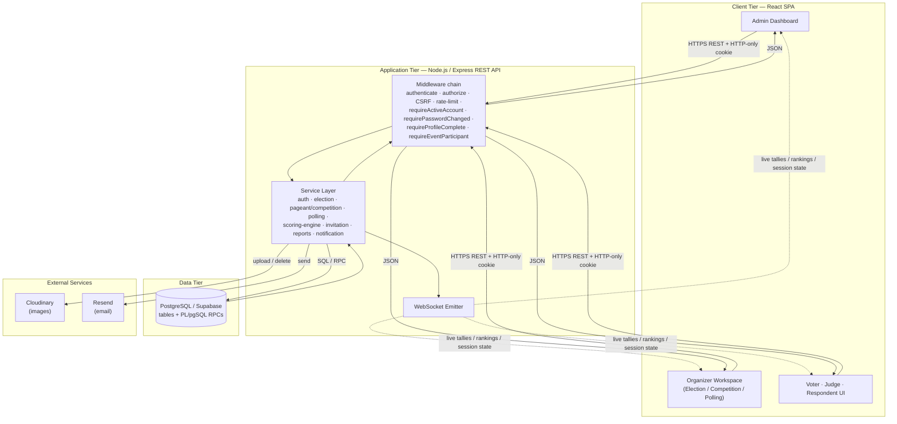

---

# §6 — 3.6 Database Schema (written + ER diagram)

**Figure 3. Database Schema (Entity–Relationship Diagram) of the VOTRIX System.**

The database is a strongly relational PostgreSQL schema managed through numbered
SQL migrations, using UUID primary keys throughout and `updated_at` triggers on
mutable tables. It is organized into five clusters: **identity/core**
(`users`, `organizations`, `events`, `event_participants`, `invitations`),
the **election module** (`positions`, `candidates`, `election_votes`), the
**competition-scoring module** (`competition_contestants`, `competition_criteria`,
`competition_minor_criteria`, `competition_categories`, `competition_rounds`,
`competition_round_contestants`, `competition_round_criteria`,
`competition_scores`, `competition_judges`, `competition_judge_assignments`,
`competition_divisions`, `competition_sessions`,
`competition_session_judge_scores`, `competition_round_results`,
`competition_awards`, `competition_award_selections`), the **polling module**
(`poll_questions`, `poll_options`, `poll_submissions`, `poll_answers`,
`poll_question_types`, `system_poll_question_types`), and the
**platform/infrastructure** tables (`audit_logs`, `notifications`,
`system_settings`, `user_sessions`, `password_reset_tokens`, `event_drafts`,
`image_assets`, `image_deletion_queue`).

The central hub is `event_participants`: a single `voter` account is linked to an
`event` with exactly one `participant_type`, and this row also carries the
completion flags (`has_voted`, `has_scored`, `has_responded`), the participant's
name, and JSONB `metadata` for information-form responses. A database trigger
(`fn_validate_participant_event_type`) enforces that the participant type matches
the event type. The diagram below shows the principal entities and cardinalities;
lookup/infra tables are summarized in the note that follows.

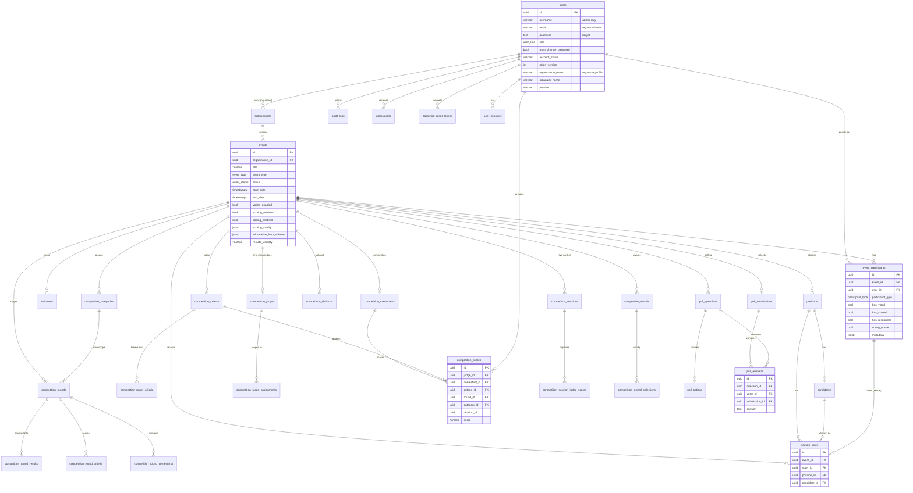

**Infrastructure tables (not drawn, summarized):** `audit_logs`
(user_id, action, entity, entity_id, JSONB details), `notifications`
(user_id, type, title, message, is_read), `system_settings` (key → JSONB value),
`user_sessions` (session tracking for admin revoke), `password_reset_tokens`
(hashed token, expiry, consumed), `event_drafts` (one per organizer+module),
`image_assets` + `image_deletion_queue` (Cloudinary reference counting),
`poll_question_types` + `system_poll_question_types` (question-type registry).

**Key integrity rules (verified):** `election_votes` has a UNIQUE
(`event_id,voter_id,position_id,candidate_id`) ballot guard; `competition_scores`
is UNIQUE per (`judge_id,contestant_id,criteria_id`); `poll_answers` is UNIQUE per
(`submission_id,question_id`); `event_participants` is UNIQUE per
(`event_id,user_id`); admins must have a username and non-admins must have an
email (CHECK constraints).

---

# §7 — 3.7 Use Case Diagrams

VOTRIX defines three system roles — admin, organizer, and voter — with the voter
specialized per event into election voter, competition judge, and polling
respondent. To keep each diagram readable, use cases are presented **per actor**
(the role-level figures, mirroring the manuscript's Figures 4–9) and each
meaningful operation is then given an **individual use-case specification**
(actors, main use case, `«include»`/`«extend»` relationships, and error cases).
Mermaid is used for the figures; the `(( ))` nodes are use cases and the
`[ ]` node is the actor.

## 3.7.1 Use Case Diagram for Authentication (all actors)

**Figure 4. Use Case Diagram for Authentication.**

Authentication is shared by every actor. Logging in `«includes»` credential
validation and session issuance; the forced first-login password change and the
optional voter "skip" `«extend»` the login flow; password recovery is a separate
pair of use cases available to email-based accounts (organizer/voter).

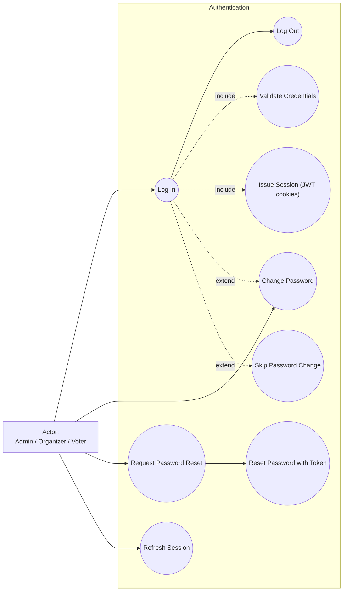

**Per-operation specifications:**

- **UC-A1 Log In.** *Actors:* Admin, Organizer, Voter. *Main:* Log In.
  *`«include»`:* Validate Credentials, Issue Session. *`«extend»`:* Change
  Password (when `must_change_password`), Skip Password Change (voter only).
  *Errors:* empty fields, invalid username/email or password, inactive/suspended/
  archived account, rate limit exceeded.
- **UC-A2 Change Password.** *Actor:* any. *Main:* Change Password. *`«include»`:*
  Re-issue Session (token-version bump invalidates old sessions). *Errors:*
  incorrect current password, weak new password.
- **UC-A3 Request/Reset Password.** *Actors:* Organizer, Voter. *Main:* Request
  Password Reset → Reset Password with Token. *Errors:* unknown email (generic
  success returned to prevent enumeration), invalid/expired/used token.
- **UC-A4 Log Out.** *Actor:* any. *`«include»`:* Revoke Session, Clear Cookies.

## 3.7.2 Use Case Diagram for the Administrator

**Figure 5. Use Case Diagram for the Administrator.**

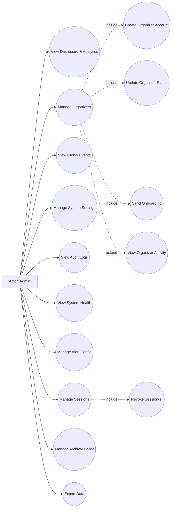

- **UC-B1 Create Organizer Account.** *Actor:* Admin. *`«include»`:* Generate
  Password, Email Credentials, Write Audit Log. *Errors:* duplicate email,
  validation error, email delivery failure.
- **UC-B2 Update Organizer Status.** *Main:* set `active`/`suspended`/`archived`.
  *`«include»`:* Write Audit Log. *`«extend»`:* Revoke Sessions (on suspend/archive).
  *Errors:* invalid status value, organizer not found.
- **UC-B3 Manage Sessions.** *`«include»`:* List Sessions → Revoke One / Revoke
  All for User (forces logout via token-version bump).
- **UC-B4 Manage System Settings / Alert Config / Archival Policy.** *`«include»`:*
  Validate, Persist (JSONB), Audit. *Errors:* invalid payload.

## 3.7.3 Use Case Diagram for the Organizer

**Figure 6. Use Case Diagram for the Organizer.**

The organizer's use cases are gated: `Complete Profile` `«include»`s the login and
must succeed before any module use case is reachable (the `requireProfileComplete`
gate). The three module clusters share the same participant-management and
publish patterns.

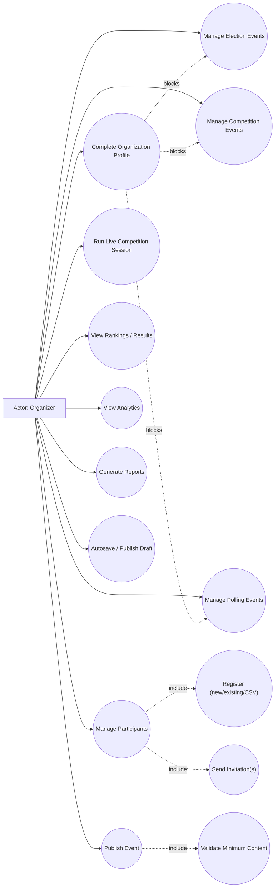

- **UC-C1 Complete Organization Profile (Onboarding).** *`«include»`:* Validate 4
  required fields. *Errors:* missing field → `PROFILE_INCOMPLETE` gate keeps
  modules locked.
- **UC-C2 Create Election/Competition/Polling Event.** *`«include»`:* Persist
  Event (draft), Clear Draft, Audit. *`«extend»`:* Upload Banner.
- **UC-C3 Manage Positions & Candidates (Election).** *`«include»`:* CRUD.
  *Errors:* delete blocked when votes exist (409).
- **UC-C4 Manage Competition Structure.** *`«include»`:* Manage Divisions,
  Categories, Rounds, Criteria, Minor Criteria, Contestants, Scoring Config.
  *`«extend»`:* Assign Round Contestants/Criteria.
- **UC-C5 Manage Judges & Assignments.** *`«include»`:* Invite Judge, Assign Scope
  (event/category/round/division). *Errors:* cross-event scope guard.
- **UC-C6 Publish Event.** *`«include»`:* Validate Minimum Content (election: ≥1
  position, ≥1 candidate, ≥1 voter). *Errors:* missing content, already published.
- **UC-C7 Run Live Competition Session.** *`«include»`:* Start, Set Round, Set/Next
  Contestant, Set Active Criteria, Pause/Resume, Finalize Round, Complete.
- **UC-C8 View Rankings / Analytics / Reports.** *`«include»`:* Compute Weighted
  Rankings, Aggregate Tallies, Export.

## 3.7.4 Use Case Diagram for the Election Voter

**Figure 7. Use Case Diagram for the Election Voter.**

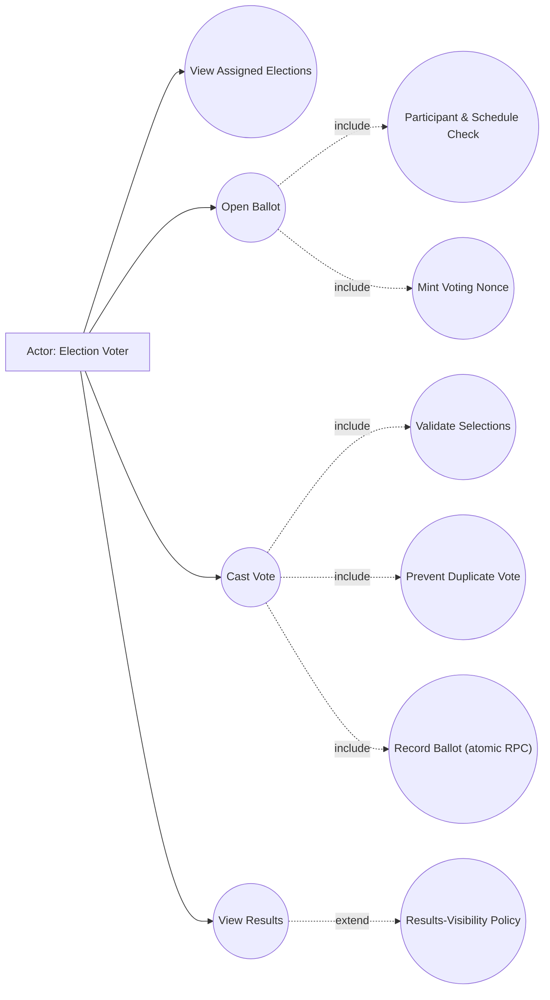

- **UC-D1 Cast Vote.** *Actor:* Election Voter. *Main:* Cast Vote. *`«include»`:*
  Validate Selections (min/max per position, allow-skip, valid candidate), Nonce
  Replay Check, Record Ballot atomically, Prevent Duplicate Vote. *Errors:* voting
  not open / not started / ended, invalid position/candidate, no selection,
  already voted (409), stale nonce.

## 3.7.5 Use Case Diagram for the Competition Judge

**Figure 8. Use Case Diagram for the Competition Judge.**

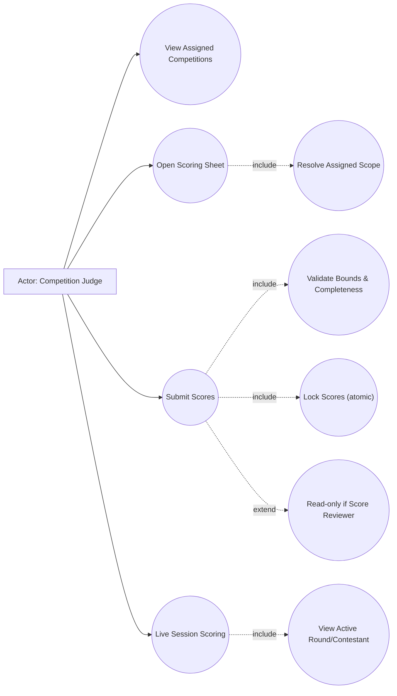

- **UC-E1 Submit Scores (classic).** *Actor:* Judge. *`«include»`:* Resolve Scope
  (allowed divisions/rounds/categories), Validate every contestant×criteria cell,
  Validate bounds by event score scale, Lock (`has_scored` flip + insert). *Errors:*
  scoring not open, not assigned to scope, reviewer read-only, incomplete grid,
  out-of-range score, duplicate/already submitted (409).
- **UC-E2 Live Session Scoring.** *`«include»`:* View organizer-controlled active
  round/contestant/criteria, Submit per-contestant score row (lockable).

## 3.7.6 Use Case Diagram for the Polling Respondent

**Figure 9. Use Case Diagram for the Polling Respondent.**

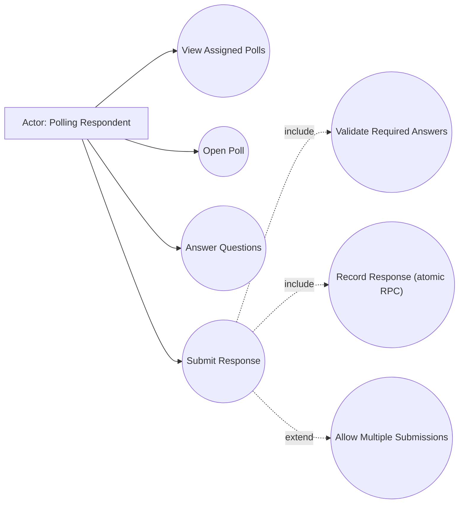

- **UC-F1 Submit Poll Response.** *Actor:* Respondent. *`«include»`:* Validate
  answers against question types/required, Record submission+answers atomically,
  Single-submission guard. *`«extend»`:* multiple submissions when the organizer
  enabled `poll_allow_multiple_submissions`. *Errors:* poll closed/expired, already
  responded (409), missing required answer.

---

# §8 — 3.8 Activity Diagrams

Each activity diagram documents one operation from the actor's first action
through every validation and decision point to the recorded outcome. The flows
below reflect the actual control paths in the VOTRIX services and middleware.

## 3.8.1 Activity Diagram for Login

**Figure 12. Activity Diagram for Login.**

Login is a single unified flow for all three roles. After credential validation
the system checks account status, then branches on `must_change_password`: an
organizer or voter on first login is routed to a forced password change (a voter
may instead choose to keep the temporary password), after which the session is
re-issued and the user is redirected to the dashboard that matches their role.

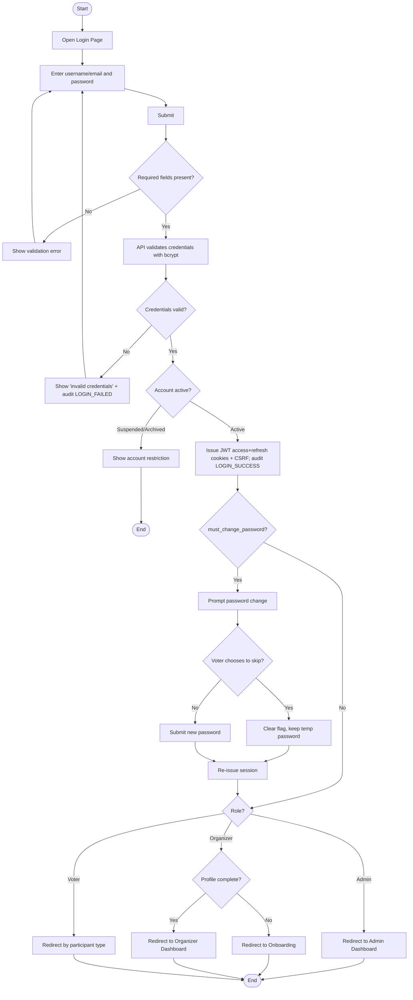

## 3.8.2 Activity Diagram for Password Recovery

**Figure 13. Activity Diagram for Password Recovery (Forgot → Reset).**

To prevent account enumeration, the request step always reports generic success
regardless of whether the email exists; only a valid, unexpired, unused token
permits an actual password change.

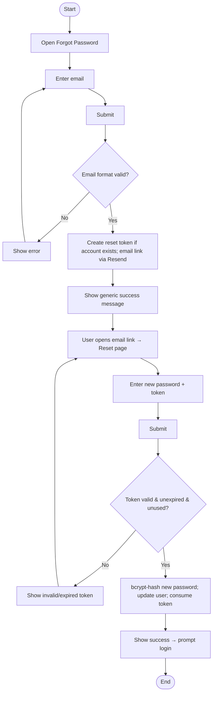

## 3.8.3 Activity Diagram for Creating an Organizer Account (Admin)

**Figure 14. Activity Diagram for Creating an Organizer Account.**

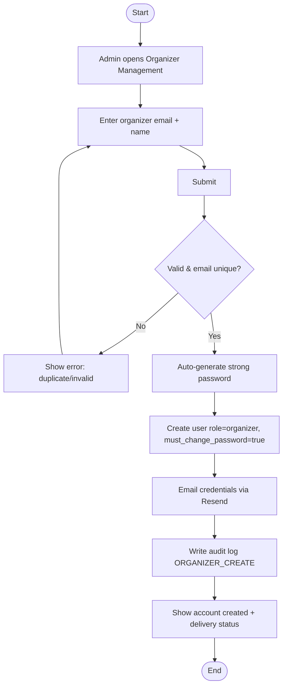

## 3.8.4 Activity Diagram for Organizer Onboarding (Profile Completion)

**Figure 15. Activity Diagram for Organizer Onboarding.**

Until the four required profile fields are saved, every organizer module route
returns a `PROFILE_INCOMPLETE` gate, so onboarding is a hard prerequisite.

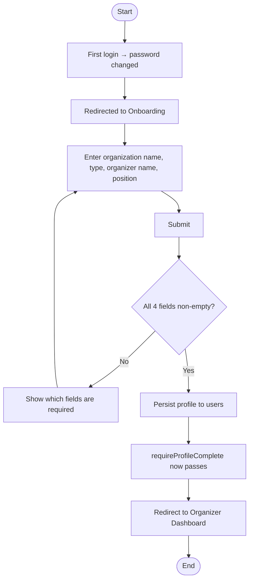

## 3.8.5 Activity Diagram for Creating an Election Event

**Figure 16. Activity Diagram for Creating an Election Event.**

```mermaid
flowchart TD
    S([Start]) --> A[Open Election → Create]
    A --> B[Enter title, description, dates, results visibility]
    B --> C[Optionally upload banner to Cloudinary]
    C --> D[Submit]
    D --> E{Dates valid (end ≥ start)?}
    E -- No --> F[Show date error] --> B
    E -- Yes --> G[Get-or-create organizer's election organization]
    G --> H[Insert event: status=draft, voting_enabled=false]
    H --> I[Clear persistent draft; write audit; invalidate dashboard cache]
    I --> J[Open event workspace] --> Z([End])
```

## 3.8.6 Activity Diagram for Registering a Voter and Sending an Invitation

**Figure 17. Activity Diagram for Voter Registration + Invitation.**

VOTRIX deliberately **separates registration from invitation**: registering only
creates/enrolls the account (invitation marked *not sent*); a distinct action
emails the credentials. This lets an organizer prepare a full roster before any
email goes out.

```mermaid
flowchart TD
    S([Start]) --> A[Open event → Voters]
    A --> B{Method?}
    B -- New --> C[Enter email]
    B -- Existing --> D[Enter known voter email]
    B -- CSV --> E[Upload CSV → preview mapping]
    C --> F{Account exists?}
    F -- No --> G[Create voter + temp password + must_change_password]
    F -- Yes --> H[Reuse account]
    D --> I{Exists, is voter, not enrolled?}
    I -- No --> J[Show 404/409 error] --> A
    I -- Yes --> H
    E --> K[Validate rows] --> L[Bulk create/enroll]
    G & H & L --> M[Enroll as ELECTION_VOTER participant]
    M --> N[Create invitation record: invitation_sent=false]
    N --> O[Roster shows 'Pending']
    O --> P{Send invitation now?}
    P -- No --> Z([End])
    P -- Yes --> Q[Send temp password (new) or 'you are invited' (existing) via Resend]
    Q --> R[Mark invitation_sent=true → 'Sent'] --> Z
```

## 3.8.7 Activity Diagram for Publishing an Election

**Figure 18. Activity Diagram for Publishing an Election.**

Publishing does not open voting; it releases the event from setup into the
schedule-driven lifecycle. Minimum-content validation is enforced first.

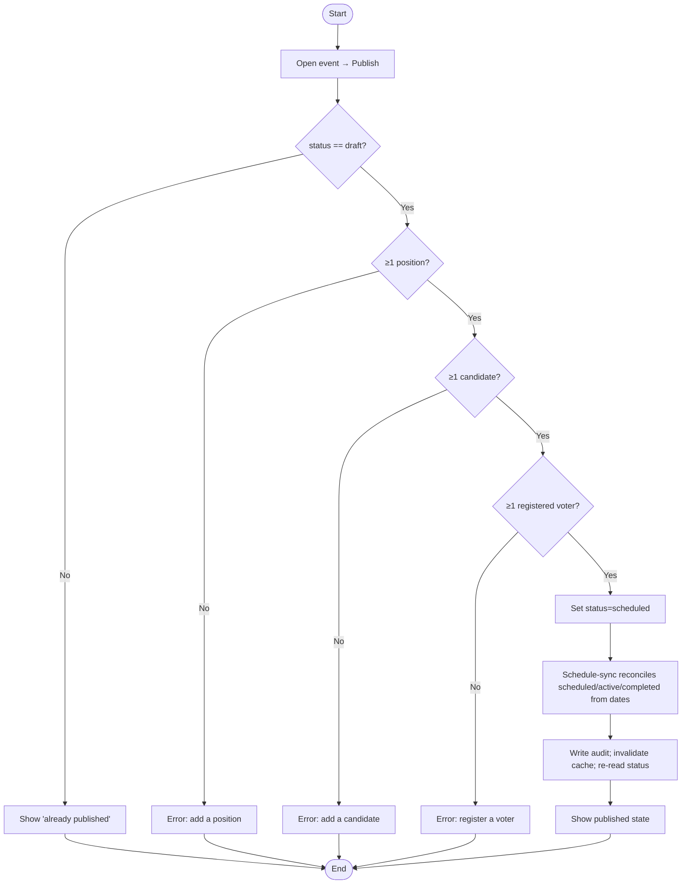

## 3.8.8 Activity Diagram for Casting a Vote (expanded)

**Figure 19. Activity Diagram for Casting a Vote.**

This expands the manuscript's single activity diagram to the true control path,
including the replay-protection nonce, the schedule-based openness check, ballot
validation, and the **atomic** database transaction that both locks the voter and
records the ballot so a crash can never leave a voter marked as voted with no
ballot.

```mermaid
flowchart TD
    S([Start]) --> A[Log in as voter → select election]
    A --> B[Open ballot]
    B --> C{Enrolled participant?}
    C -- No --> D[403 not a participant] --> Z([End])
    C -- Yes --> E[Mint voting nonce if absent]
    E --> F[Display positions + candidates]
    F --> G[Select candidates per position]
    G --> H[Submit ballot + nonce]
    H --> I{Event published (not draft)?}
    I -- No --> J[403 not published] --> Z
    I -- Yes --> K{Nonce matches?}
    K -- No --> L[400 stale voting session → refresh] --> B
    K -- Yes --> M{Voting open by schedule + voting_enabled?}
    M -- No --> N[403 not started / ended / closed] --> Z
    M -- Yes --> O{Selections valid?<br/>min/max, allow-skip, valid candidate, no dup}
    O -- No --> P[400 validation error] --> F
    O -- Yes --> Q[RPC cast_election_ballot:<br/>flip has_voted FALSE→TRUE + insert votes in ONE transaction]
    Q --> R{RPC committed?}
    R -- Already voted / not enrolled --> T[409 already voted] --> Z
    R -- Unique violation --> T
    R -- Yes --> U[Mark invitation_sent=true; recompute turnout]
    U --> V[WebSocket push to organizer/admin; secret-ballot audit (count only)]
    V --> W[Show confirmation; ballot locked] --> Z
```

## 3.8.9 Activity Diagram for Configuring Competition Structure & Scoring

**Figure 20. Activity Diagram for Competition Configuration.**

A competition is built as a hierarchy (optional divisions → optional categories →
rounds → criteria → optional minor criteria) with a scoring configuration. The
diagram highlights the weight-consistency and completeness conditions the
organizer must satisfy before a meaningful ranking can be produced.

```mermaid
flowchart TD
    S([Start]) --> A[Create competition event + select competition type]
    A --> B[Set scoring config: score type + calculation method]
    B --> C{Enable divisions?}
    C -- Yes --> D[Create divisions]
    C -- No --> E[Event-wide mode]
    D & E --> F{Use categories?}
    F -- Yes --> G[Create categories with weights]
    F -- No --> H[Criteria apply event-wide]
    G & H --> I[Create rounds with weights]
    I --> J[Assign round contestants + round criteria]
    J --> K[Create criteria with percentage weights]
    K --> L{Add minor criteria?}
    L -- Yes --> M[Create minors, each with own score scale]
    L -- No --> N[Criteria scored directly]
    M & N --> O[Add contestants (+ per-division numbers, photos)]
    O --> P[Invite judges + set assignment scopes]
    P --> Q{Configuration complete?<br/>criteria weights, round weights,<br/>≥1 judge, ≥1 contestant, valid scopes}
    Q -- No --> R[Show warnings on totals/missing items] --> B
    Q -- Yes --> T[Ready to open scoring / start live session] --> Z([End])
```

> **Validation note (verified vs. not confirmed).** The engine reports weight
> totals (`criterionTotals`, `roundTotals`, `categoryTotals`) back to the
> organizer as feedback, and it **normalizes** legacy round weights that don't sum
> to 100 so a score cannot exceed a single round's value. A **hard block** that
> refuses to open scoring purely because weights ≠ 100% is **not confirmed**; the
> system surfaces the totals and computes with normalization rather than blocking.
> Judge scope guards (assignment must belong to the same event; reviewer is
> read-only) and the "score every contestant × criteria cell" completeness rule
> **are** enforced at submission.

## 3.8.10 Activity Diagram for Submitting Judge Scores (classic)

**Figure 21. Activity Diagram for Judge Score Submission.**

```mermaid
flowchart TD
    S([Start]) --> A[Judge opens assigned competition]
    A --> B[Load scoring sheet within assigned scope]
    B --> C[Enter score for each contestant × criterion]
    C --> D[Submit]
    D --> E{Scoring open (schedule + scoring_enabled)?}
    E -- No --> F[403 not open / not started / ended] --> Z([End])
    E -- Yes --> G{Judge active & not score_reviewer?}
    G -- No --> H[403 inactive / reviewer read-only] --> Z
    G -- Yes --> I{Every contestant×criteria cell present, no duplicates?}
    I -- No --> J[400 complete-grid error] --> C
    I -- Yes --> K{All scores within event score scale?}
    K -- No --> L[400 out-of-range] --> C
    K -- Yes --> M{Each score within assigned scope?}
    M -- No --> N[403 not assigned to score this] --> Z
    M -- Yes --> O[Atomically flip has_scored FALSE→TRUE]
    O --> P{Claimed (not already scored)?}
    P -- No --> Q[409 already submitted] --> Z
    P -- Yes --> R[Insert score rows]
    R --> S2{Insert ok?}
    S2 -- Unique/err --> T[Roll back has_scored; 409/500] --> Z
    S2 -- Yes --> U[Recompute live rankings; WebSocket push]
    U --> V[Show 'scores submitted and locked'] --> Z
```

## 3.8.11 Activity Diagram for the Live Competition Session

**Figure 22. Activity Diagram for Live Session Control + Judge Live Scoring.**

In a live session the organizer drives what judges see; judges score the
currently active contestant/round while the organizer navigates and finalizes.

```mermaid
flowchart TD
    S([Start]) --> A[Organizer starts session (one active per event)]
    A --> B[Set active round + active criteria]
    B --> C[Set / advance active contestant (or stage group)]
    C --> D[Judges' session-view updates via WebSocket]
    D --> E[Judge submits per-contestant score row]
    E --> F{Score row locked already?}
    F -- Yes --> G[409 locked] --> D
    F -- No --> H[Save session judge scores (JSONB)]
    H --> I[Organizer monitors judge-progress]
    I --> J{Round complete?}
    J -- No --> C
    J -- Yes --> K[Preview advancement → Finalize round]
    K --> L[Persist round results; advance top-N/%/threshold/manual]
    L --> M{More rounds?}
    M -- Yes --> B
    M -- No --> N[Complete session] --> Z([End])
```

## 3.8.12 Activity Diagram for Submitting a Poll Response

**Figure 23. Activity Diagram for Poll Response Submission.**

```mermaid
flowchart TD
    S([Start]) --> A[Respondent opens assigned poll]
    A --> B[Answer questions] --> C[Submit + startedAt]
    C --> D{Poll open / not expired?}
    D -- No --> E[403 closed/expired] --> Z([End])
    D -- Yes --> F{Required answers present & valid per type?}
    F -- No --> G[400 validation error] --> B
    F -- Yes --> H[RPC cast_poll_response]
    H --> I{allow_multiple?}
    I -- Yes --> J[Mark responded; insert submission + answers]
    I -- No --> K{First submission (claim slot)?}
    K -- No --> L[409 already responded] --> Z
    K -- Yes --> J
    J --> M[Return submission id; confirmation] --> Z
```

## 3.8.13 Activity Diagram for a Generic Managed Entity (representative CRUD)

**Figure 24. Activity Diagram for Create/Update/Delete of a Managed Entity.**

The many organizer CRUD operations (positions, candidates, contestants, criteria,
minor criteria, categories, rounds, divisions, judges, poll questions) share one
pattern, shown once here to avoid a redundant figure per entity. Only the
delete-guard differs by entity (e.g. positions/candidates block deletion once
votes exist).

```mermaid
flowchart TD
    S([Start]) --> A[Open entity manager]
    A --> B{Action?}
    B -- Create --> C[Enter fields] --> D[Submit]
    B -- Update --> E[Edit fields] --> D
    B -- Delete --> F{Referenced by recorded data?<br/>e.g. votes/scores exist}
    F -- Yes --> G[409 cannot delete] --> Z([End])
    F -- No --> H[Delete row + cleanup media asset] --> I
    D --> J{Ownership + validation pass?<br/>assertOrganizerOwnsEvent + rules}
    J -- No --> K[400/403/404 error] --> A
    J -- Yes --> L[Insert/Update row]
    L --> I[Write audit; return entity] --> Z
```

---

# §9 — 3.9 Sequence Diagrams

Each sequence diagram shows the time-ordered messages between the actual VOTRIX
components: the client (React UI), the Express API with its middleware chain, the
service layer, the PostgreSQL database (including PL/pgSQL RPCs), and the external
Cloudinary, Resend, and WebSocket services where used. Only components genuinely
involved in each operation appear.

## 3.9.1 Sequence Diagram for Login

**Figure 25. Sequence Diagram for Login.**

```mermaid
sequenceDiagram
    actor U as User (Admin/Organizer/Voter)
    participant UI as React UI
    participant API as Express API
    participant AV as Auth Validator
    participant SVC as Auth Service
    participant DB as PostgreSQL
    U->>UI: Enter credentials, Submit
    UI->>API: POST /auth/login (email/username, password)
    API->>AV: validateLogin(body)
    AV-->>API: sanitized credentials
    API->>SVC: login(credentials)
    SVC->>DB: SELECT user by email/username
    DB-->>SVC: user row (bcrypt hash, role, status, flags)
    SVC->>SVC: bcrypt.compare(password)
    alt invalid / inactive
        SVC-->>API: throw ApiError(401/403)
        API->>DB: INSERT audit LOGIN_FAILED
        API-->>UI: 401/403 error
        UI-->>U: Show error
    else valid & active
        SVC-->>API: {access, refresh, user}
        API->>DB: INSERT audit *_LOGIN_SUCCESS
        API-->>UI: Set-Cookie (JWT httpOnly) + CSRF + user
        UI-->>U: Redirect by role / must_change_password
    end
```

## 3.9.2 Sequence Diagram for Password Recovery

**Figure 26. Sequence Diagram for Password Recovery.**

```mermaid
sequenceDiagram
    actor U as User
    participant UI as React UI
    participant API as Express API
    participant PS as Password-Reset Service
    participant DB as PostgreSQL
    participant RS as Resend (Email)
    U->>UI: Enter email, Submit (Forgot)
    UI->>API: POST /auth/forgot-password
    API->>PS: requestPasswordReset(email)
    PS->>DB: SELECT user by email
    alt exists
        PS->>DB: INSERT password_reset_tokens (hashed, expiry)
        PS->>RS: send reset link
    end
    PS-->>API: generic success (no enumeration)
    API-->>UI: 200 generic message
    U->>UI: Open link, enter new password, Submit (Reset)
    UI->>API: POST /auth/reset-password (token, newPassword)
    API->>PS: resetPasswordWithToken()
    PS->>DB: SELECT token (unexpired, unused)
    alt invalid/expired
        PS-->>API: ApiError(400)
        API-->>UI: error
    else valid
        PS->>DB: UPDATE user password (bcrypt); consume token
        PS-->>API: success
        API-->>UI: 200 → prompt login
    end
```

## 3.9.3 Sequence Diagram for Creating an Organizer Account

**Figure 27. Sequence Diagram for Creating an Organizer Account.**

```mermaid
sequenceDiagram
    actor A as Admin
    participant UI as React UI
    participant API as Express API (admin)
    participant MW as authenticate+authorize(ADMIN)
    participant SVC as User Service
    participant DB as PostgreSQL
    participant RS as Resend
    A->>UI: Enter organizer email + name
    UI->>API: POST /admin/organizers
    API->>MW: verify admin session
    MW-->>API: ok
    API->>SVC: createOrganizer(email, name)
    SVC->>DB: SELECT user by email (uniqueness)
    alt duplicate
        SVC-->>API: ApiError(409)
        API-->>UI: error
    else new
        SVC->>SVC: generate strong password + bcrypt hash
        SVC->>DB: INSERT user role=organizer, must_change_password=true
        SVC->>RS: email credentials
        SVC->>DB: INSERT audit ORGANIZER_CREATE
        SVC-->>API: {user, email}
        API-->>UI: 201 created + delivery status
    end
```

## 3.9.4 Sequence Diagram for Creating an Event with Banner Upload

**Figure 28. Sequence Diagram for Event Creation + Banner Upload.**

```mermaid
sequenceDiagram
    actor O as Organizer
    participant UI as React UI
    participant API as Express API
    participant MW as auth+profileComplete
    participant SVC as Election Service
    participant CLD as Cloudinary
    participant DB as PostgreSQL
    O->>UI: Fill event form, choose banner
    UI->>API: POST /organizer/election/events/:id/banner (multipart)
    API->>MW: verify organizer + profile complete
    API->>CLD: upload image
    CLD-->>API: secure URL + public id
    API->>DB: INSERT image_assets (reference)
    API-->>UI: banner URL
    UI->>API: POST /organizer/election/events (title, dates, banner)
    API->>SVC: createElectionEvent(payload)
    SVC->>DB: get-or-create organization
    SVC->>DB: INSERT event (status=draft, voting_enabled=false)
    SVC->>DB: DELETE persistent draft; INSERT audit
    SVC-->>API: event
    API-->>UI: 201 → open workspace
```

## 3.9.5 Sequence Diagram for Registering a Voter and Sending an Invitation

**Figure 29. Sequence Diagram for Voter Registration + Invitation.**

```mermaid
sequenceDiagram
    actor O as Organizer
    participant UI as React UI
    participant API as Express API
    participant INV as Invitation Service
    participant DB as PostgreSQL
    participant RS as Resend
    O->>UI: Enter voter email, Register
    UI->>API: POST /organizer/election/events/:id/voters/register
    API->>INV: registerVoterToEvent()
    INV->>DB: assertOrganizerOwnsEvent
    INV->>DB: SELECT user by email
    alt new
        INV->>DB: INSERT user + temp password + must_change_password
    end
    INV->>DB: INSERT event_participants (ELECTION_VOTER)
    INV->>DB: UPSERT invitations (invitation_sent=false)
    INV-->>API: {user, invitationSent:false}
    API-->>UI: 'Registered (Pending)'
    O->>UI: Click Send Invitation
    UI->>API: POST .../voters/:voterId/send-invitation
    API->>INV: sendVoterInvitation()
    INV->>RS: email temp password (new) / 'invited' (existing)
    INV->>DB: UPDATE invitations set invitation_sent=true
    INV-->>API: sent
    API-->>UI: 'Invitation Sent'
```

## 3.9.6 Sequence Diagram for Vote Submission (expanded)

**Figure 30. Sequence Diagram for Vote Submission.**

This replaces the manuscript's Figure 11 with the true message flow, including
the `requireEventParticipant` guard, the nonce/schedule checks, the atomic
`cast_election_ballot` RPC, and the WebSocket push to organizer and admin
dashboards.

```mermaid
sequenceDiagram
    actor V as Voter
    participant UI as React UI
    participant API as Express API
    participant MW as authenticate + requireEventParticipant(ELECTION_VOTER)
    participant SVC as Election Service
    participant DB as PostgreSQL
    participant RPC as cast_election_ballot (PL/pgSQL)
    participant WS as WebSocket
    V->>UI: Open ballot
    UI->>API: GET /voter/election/events/:id/ballot
    API->>MW: verify session + participant
    API->>SVC: getVoterBallot()
    SVC->>DB: SELECT participant; mint voting_nonce if absent
    SVC->>DB: SELECT positions + candidates
    SVC-->>API: ballot + nonce + votingOpen
    API-->>UI: render ballot
    V->>UI: Select candidates, Submit
    UI->>API: POST /voter/election/events/:id/vote (selections, nonce)
    API->>SVC: submitBallot()
    SVC->>SVC: check not-draft, nonce match, voting open, validate selections
    alt validation fails
        SVC-->>API: ApiError(400/403)
        API-->>UI: error
    else valid
        SVC->>RPC: cast_election_ballot(event, voter, votes)
        RPC->>DB: UPDATE event_participants has_voted FALSE→TRUE (claim)
        RPC->>DB: INSERT election_votes rows
        RPC-->>SVC: TRUE (committed) / FALSE (already voted)
        alt already voted / unique violation
            SVC-->>API: ApiError(409)
            API-->>UI: 'already voted'
        else committed
            SVC->>DB: UPSERT invitation_sent=true; recount turnout
            SVC->>WS: emit vote-submitted / stats-updated
            SVC->>DB: audit election.vote.cast (count only, secret ballot)
            SVC-->>API: {success, locked:true}
            API-->>UI: confirmation
            WS-->>UI: live turnout update (organizer/admin)
        end
    end
```

## 3.9.7 Sequence Diagram for Judge Score Submission

**Figure 31. Sequence Diagram for Judge Score Submission.**

```mermaid
sequenceDiagram
    actor J as Judge
    participant UI as React UI
    participant API as Express API
    participant MW as requireEventParticipant(COMPETITION_JUDGE)
    participant SVC as Pageant/Competition Service
    participant ENG as Scoring Engine
    participant DB as PostgreSQL
    participant WS as WebSocket
    J->>UI: Open scoring sheet
    UI->>API: GET /voter/competition/events/:id/score
    API->>SVC: getJudgeScoringSheet()
    SVC->>DB: resolve assigned scope; SELECT contestants+criteria+existing scores
    SVC-->>API: sheet
    API-->>UI: render grid
    J->>UI: Enter all scores, Submit
    UI->>API: POST /voter/competition/events/:id/score
    API->>SVC: submitJudgeScores()
    SVC->>SVC: scoring open? scope active? reviewer? complete grid? in bounds?
    alt fails
        SVC-->>API: ApiError(400/403)
        API-->>UI: error
    else ok
        SVC->>DB: UPDATE has_scored FALSE→TRUE (atomic claim)
        alt already scored
            SVC-->>API: ApiError(409)
        else claimed
            SVC->>DB: INSERT competition_scores rows
            SVC->>ENG: computeRankings(scores, criteria, rounds, categories, config)
            ENG-->>SVC: ranked results
            SVC->>WS: emit rankings:updated + stats-updated
            SVC-->>API: {success, locked:true}
            API-->>UI: 'scores submitted and locked'
            WS-->>UI: live rankings (organizer)
        end
    end
```

## 3.9.8 Sequence Diagram for the Live Competition Session

**Figure 32. Sequence Diagram for Live Session (Organizer drives, Judge scores).**

```mermaid
sequenceDiagram
    actor O as Organizer
    actor J as Judge
    participant API as Express API
    participant SVC as Competition-Session Service
    participant DB as PostgreSQL
    participant WS as WebSocket
    O->>API: POST /session/start
    API->>SVC: startSession()
    SVC->>DB: INSERT competition_sessions (active; unique per event)
    SVC->>WS: emit session state
    WS-->>J: session-view updates
    O->>API: POST /session/set-round, /set-active-criteria, /set-contestant
    API->>SVC: update active round/criteria/contestant
    SVC->>DB: UPDATE competition_sessions
    SVC->>WS: emit session state
    WS-->>J: active contestant/round
    J->>API: POST /events/:id/session-score
    API->>SVC: submitJudgeSessionScore()
    SVC->>DB: UPSERT competition_session_judge_scores (JSONB; lockable)
    SVC->>WS: emit judge-progress
    WS-->>O: progress update
    O->>API: POST /session/finalize-round (roundId)
    API->>SVC: finalizeRound()
    SVC->>DB: compute + INSERT competition_round_results; advance contestants
    SVC-->>O: finalized + advancement
    O->>API: POST /session/complete
    API->>SVC: completeSession()
    SVC->>DB: UPDATE session completed
```

## 3.9.9 Sequence Diagram for Poll Response Submission

**Figure 33. Sequence Diagram for Poll Response Submission.**

```mermaid
sequenceDiagram
    actor R as Respondent
    participant UI as React UI
    participant API as Express API
    participant MW as requireEventParticipant(POLLING_RESPONDENT)
    participant SVC as Polling Service
    participant RPC as cast_poll_response (PL/pgSQL)
    participant DB as PostgreSQL
    R->>UI: Answer questions, Submit
    UI->>API: POST /voter/polling/events/:id/submit (answers, startedAt)
    API->>SVC: submitPollResponse()
    SVC->>SVC: poll open? required answers valid?
    alt fails
        SVC-->>API: ApiError(400/403)
    else ok
        SVC->>RPC: cast_poll_response(event, voter, startedAt, allowMultiple, answers)
        RPC->>DB: claim slot (or mark responded) 
        RPC->>DB: INSERT poll_submissions + poll_answers
        RPC-->>SVC: submission id / NULL if already responded
        alt already responded
            SVC-->>API: ApiError(409)
        else recorded
            SVC-->>API: {submissionId}
            API-->>UI: confirmation
        end
    end
```

## 3.9.10 Sequence Diagram for Viewing Rankings / Results

**Figure 34. Sequence Diagram for Ranking Computation.**

```mermaid
sequenceDiagram
    actor O as Organizer
    participant API as Express API
    participant SVC as Competition Service
    participant DB as PostgreSQL
    participant ENG as Scoring Engine
    O->>API: GET /organizer/competition/events/:id/rankings
    API->>SVC: getLiveRankings()
    SVC->>DB: SELECT contestants, criteria, minors, rounds, categories, scores, config
    DB-->>SVC: rows
    SVC->>ENG: computeRankings({scores, criteria, rounds, categories, roundCriteria, config})
    ENG->>ENG: per-minor % → per-criterion avg → per-round weighted → per-category → final; assign 1224 ranks (+ optional tie-break)
    ENG-->>SVC: {rankings, debug totals}
    SVC-->>API: rankings
    API-->>O: ranked table + weight totals
```

---

# §10 — Deep Dive: Voting (end-to-end)

The complete election-voting path, as implemented, is:

1. **Login & session** — voter authenticates; JWT cookies issued; if
   `must_change_password`, password is changed or skipped (voter keeps temp).
2. **Account validation** — `requireActiveAccount` checks status and token
   version on every request.
3. **Election availability** — `listVoterElectionEvents` returns only events where
   the user is an `ELECTION_VOTER` participant.
4. **Participant/eligibility gate** — `requireEventParticipant('ELECTION_VOTER')`
   attaches the participant row; non-participants get 403.
5. **Ballot display** — `getVoterBallot` mints a `voting_nonce` (single-use
   replay token) into `event_participants`, returns positions with candidates,
   plus `votingOpen`, `resultsVisibility`, `hasVoted`.
6. **Selection & submission** — voter selects candidates (respecting each
   position's `max_vote` and `allow_skip`) and submits with the nonce.
7. **Server validation** — not-draft; nonce match; `isElectionVotingOpen`
   (schedule + `voting_enabled`); per-position min/max/skip; candidate belongs to
   position; no duplicate candidate.
8. **Atomic recording** — `cast_election_ballot` PL/pgSQL RPC flips
   `has_voted` FALSE→TRUE **and** inserts every `election_votes` row inside one
   transaction. If the voter already voted (or isn't enrolled), it claims nothing
   and returns FALSE → **409**. The UNIQUE `election_votes_unique_ballot`
   constraint is the final guard (23505 → 409).
9. **Duplicate prevention** — enforced twice: the atomic FALSE→TRUE claim and the
   unique constraint. A crash mid-write rolls back both the flag and the inserts.
10. **Audit** — `recordEventActivity('election.vote.cast')` stores only the
    **selection count**, never the choices, preserving secret-ballot
    confidentiality.
11. **Real-time & stats** — WebSocket `election:vote-submitted` and
    `organizer:stats-updated`/`platform:stats-updated` refresh dashboards;
    turnout is recomputed with a single rounding convention.
12. **Results behavior** — voters can view results only when the event's
    `results_visibility` policy (`public`/after-close/etc.) allows
    (`canVoterViewElectionResults`); otherwise 403.

**Voting type note.** VOTRIX implements **one** election-ballot voting type
(position-based, one-or-many candidates per position governed by `max_vote`/
`allow_skip`). Ranked/preferential or weighted electoral voting is **not
confirmed** in the code. Polling (§9.9) is a distinct submission path with its own
question types and its own RPC.

---

# §11 — Deep Dive: Competition Scoring (hierarchy + actual formula)

## 11.1 Hierarchy (as implemented)

```
Event (competition_scoring | pageant)
  └─ scoring_config (JSONB: scoreType, calculationMethod, decimalPlaces,
                     customMin/Max, dropHighest/dropLowest, tieBreaker)
  └─ Division (optional)          competition_divisions
  └─ Category (optional, weighted) competition_categories
       └─ Round (weighted)         competition_rounds  (round may be event-wide or category-scoped)
            ├─ Round↔Contestant    competition_round_contestants
            └─ Round↔Criteria      competition_round_criteria
  └─ Criterion (percentage weight) competition_criteria
       └─ Minor Criterion (own scale) competition_minor_criteria
  └─ Contestant                    competition_contestants
  └─ Judge                         event_participants(COMPETITION_JUDGE) + competition_judges
       └─ Assignment (scope)       competition_judge_assignments (event|category|round|division)
  └─ Score                         competition_scores (judge×contestant×criterion, +round/category/division)
  └─ Live session                  competition_sessions + competition_session_judge_scores
  └─ Round result / advancement    competition_round_results
  └─ Award                         competition_awards + competition_award_selections
```

## 11.2 Score scales (`scoreType`) — verified in `resolveScoreBounds`

| `scoreType` | Range |
|---|---|
| `range_1_10` | 1–10 |
| `range_1_100` | 1–100 (default) |
| `decimal` | 0–10 |
| `custom_range` | `customMin`–`customMax` |

## 11.3 Calculation methods (`calculationMethod`) — verified in `reduceScores`

`average`, `weighted_average` (default), `sum`, `highest_score`,
`lowest_removal` (drops `dropLowest` lowest and `dropHighest` highest judge
scores, then averages the rest).

## 11.4 The actual computation (from `scoring-engine.js`)

The engine composes the final score bottom-up. Let J be the set of judges who
scored a given cell.

**(a) Per minor criterion** — reduce judge scores (default: average across
judges), then normalize to a percentage of that minor's own maximum so minors on
different scales can be combined:

```
minorPercent = ( reduce_J(score) / minorMax ) × 100
```

**(b) Per criterion value**
- *With minors:* the plain average of its minors' percents (minors carry equal
  weight; they have no individual percentage):
  `criterionValue = mean(minorPercent_i)`
- *Without minors:* `criterionValue = reduce_J(score)` (raw, per the method).

**(c) Per round value** (weighted-average method; scoped mode uses only the
round's own criteria, normalized within the round):

```
roundValue = Σ_over_round_criteria [ criterionValue × ( criterion.percentage / Σ criterion.percentage_in_round ) ]
```

**(d) Final score**
- *No categories:*
  `finalScore = Σ_over_rounds [ roundValue × ( round.weight × scale / 100 ) ]`
  where `scale = 100 / Σ round.weight` in the legacy (non-scoped) path so weights
  that don't total 100 cannot inflate the result; `scale = 1` in scoped mode.
- *With categories:*
  `categoryValue = Σ_its_rounds [ roundValue × (round.weight/100) ]`, then
  `finalScore = Σ_categories [ categoryValue × (category.weight/100) ]` plus any
  event-wide rounds.

**(e) Ranking** — contestants are sorted by `finalScore` descending and given
**standard competition ranks ("1224")**: equal final scores share a rank and the
next distinct score resumes at its ordinal position. An optional deterministic
tie-breaker (`tieBreaker = 'highest_criterion'`) breaks ties by the contestant's
single highest per-criterion average. All values are rounded to
`decimalPlaces` (0–6, default 2).

> This is the **real** formula. The generic "Criterion × Weight, then Round ×
> Weight, then Overall" description in the brief is *approximately* right for the
> weighted-average path, but the verified engine adds: minor-criterion percentage
> normalization, per-round criterion normalization in scoped mode, legacy
> round-weight normalization, category weighting, four alternate calculation
> methods, and 1224 tie-handling. The manuscript should state the verified
> formula, not the generic one.

## 11.5 Judge workflow (verified behaviors)

- **Prevents out-of-range scores:** yes — validated against the event score scale
  at submission (`isScoreInBounds`); per-criterion min/max is intentionally
  ignored (the event scale is the single source of truth).
- **Prevents duplicate scoring:** yes — atomic `has_scored` claim + UNIQUE
  (`judge_id,contestant_id,criteria_id`).
- **Editing scores after submit (classic path):** **no** — submission locks the
  judge (`has_scored=true`); the classic sheet is one-shot. The **live-session**
  path stores per-(session,round,contestant) rows that are lockable per round.
- **Requires a complete grid:** yes (classic) — every contestant × criterion cell
  must be present.
- **Enforces assignment scope:** yes — a judge can only score within assigned
  divisions/categories/rounds; `score_reviewer` is read-only.
- **Automatic totals / rankings:** yes — recomputed and pushed over WebSocket on
  each submission.
- **Hides other judges' scores:** the scoring sheet returns only the requesting
  judge's own existing scores (`.eq('judge_id', judgeId)`), so a judge does not
  see peers' scores. Organizer views aggregate progress.

## 11.6 Configuration validation (what the system actually checks)

Enforced: ownership (`assertOrganizerOwnsEvent`); criterion percentage 0–100 and
category/round weight 0–100 (DB CHECK); judge assignment scope belongs to the same
event (scope guard, migration 063); publish requires minimum content (election);
score completeness, bounds, and scope at judge submission; one active live session
per event. **Surfaced but not hard-blocked:** weight totals not equal to 100% (the
engine reports totals and normalizes rather than refusing). **Not confirmed:** an
explicit pre-scoring gate that blocks on "no judge assigned" / "no contestant" for
competitions (the equivalent hard gate exists for election *publish*, not for
competition scoring open).

---

# §12 — 3.10 System Previews (screenshot inventory)

Every page below exists in `frontend/src/pages/`. Capture screenshots at these
routes; do **not** include pages that do not exist (e.g. an OTP screen or a
self-registration screen — neither is implemented).

**Authentication** (`pages/auth/`)
- Login (`LoginPage`)
- Forced/First-login Password Change (`ChangePasswordPage`)
- Forgot Password (`ForgotPasswordPage`)
- Reset Password (`ResetPasswordPage`)

**Administrator** (`pages/admin/`)
- Admin Dashboard (`AdminDashboardPage`)
- Organizer Management (`OrganizerManagementPage`) + Organizer Detail (`OrganizerDetailPage`)
- Global Events (`GlobalEventsPage`)
- Audit Logs (`AuditLogsPage`)
- System Settings (`SystemSettingsPage`)
- Alert Configuration (`AlertConfigPage`)
- Archival Policy (`ArchivalPolicyPage`)
- Session Management (`SessionManagementPage`)
- Health Dashboard (`HealthDashboardPage`)

**Organizer — general** (`pages/organizer/`)
- Organizer Dashboard (`OrganizerDashboardPage`)
- Onboarding / Profile Completion (`OrganizerOnboardingPage`)

**Organizer — Election** (`pages/organizer/election/`)
- Election Dashboard, Events list, Event Form, Positions, Candidates, Voters, Analytics

**Organizer — Competition** (`pages/organizer/competition/`)
- Competition Dashboard, Events, Workspace, Contestants, Criteria, Judges,
  Live Control, Rankings, Analytics (event-form via `CompetitionEventFormPage`)

**Organizer — Polling** (`pages/organizer/polling/`)
- Polling Dashboard, Events, Event Form, Builder (questions), Respondents, Analytics

**Organizer — Reports** (`pages/organizer/reports/`)
- Reports Overview, Election Report, Competition Report, Polling Report

**Voter / Judge / Respondent** (`pages/voter/`)
- Voter Dashboard (`VoterDashboardPage`)
- Election Event / Ballot (`VoterEventPage`)
- Poll (`VoterPollPage`)
- Judge Scoring (`JudgeScoringPage`)

> **Not confirmed / do not screenshot:** OTP verification, public self-registration,
> a dedicated "voting history" page (voting state is shown via `hasVoted` on event
> cards; a standalone history page is not confirmed).

---

# §13 — Figure Numbering Scheme

A continuous, gap-free scheme aligned to the sections above:

| Fig. | Title |
|---|---|
| 1 | Conceptual Framework *(existing, Chapter I/III)* |
| 2 | Client–Server Architecture of the VOTRIX System |
| 3 | Database Schema (Entity–Relationship Diagram) |
| **Use Case** | |
| 4 | Use Case Diagram for Authentication |
| 5 | Use Case Diagram for the Administrator |
| 6 | Use Case Diagram for the Organizer |
| 7 | Use Case Diagram for the Election Voter |
| 8 | Use Case Diagram for the Competition Judge |
| 9 | Use Case Diagram for the Polling Respondent |
| **Activity** | |
| 12 | Activity Diagram for Login |
| 13 | Activity Diagram for Password Recovery |
| 14 | Activity Diagram for Creating an Organizer Account |
| 15 | Activity Diagram for Organizer Onboarding |
| 16 | Activity Diagram for Creating an Election Event |
| 17 | Activity Diagram for Voter Registration + Invitation |
| 18 | Activity Diagram for Publishing an Election |
| 19 | Activity Diagram for Casting a Vote |
| 20 | Activity Diagram for Competition Configuration |
| 21 | Activity Diagram for Judge Score Submission |
| 22 | Activity Diagram for the Live Competition Session |
| 23 | Activity Diagram for Poll Response Submission |
| 24 | Activity Diagram for a Generic Managed Entity (CRUD) |
| **Sequence** | |
| 25 | Sequence Diagram for Login |
| 26 | Sequence Diagram for Password Recovery |
| 27 | Sequence Diagram for Creating an Organizer Account |
| 28 | Sequence Diagram for Event Creation + Banner Upload |
| 29 | Sequence Diagram for Voter Registration + Invitation |
| 30 | Sequence Diagram for Vote Submission |
| 31 | Sequence Diagram for Judge Score Submission |
| 32 | Sequence Diagram for the Live Competition Session |
| 33 | Sequence Diagram for Poll Response Submission |
| 34 | Sequence Diagram for Ranking Computation |
| **System Previews** | 35+ (one per screenshot in §12, numbered in capture order) |

*(Figures 10–11 in the current manuscript — the lone activity and sequence
diagram — are absorbed and renumbered as Figures 19 and 30 respectively; see §15.)*

---

# §14 — Missing System Documentation (gap analysis vs. current manuscript)

The current Chapter III (extracted from `HALAWIG_SAMIJON_CHAPTER_1-3 updated.docx`)
contains: Fig. 2 architecture, Fig. 3 ERD, Figs. 4–9 six per-actor use case
diagrams, **one** activity diagram (Fig. 10, casting a vote), **one** sequence
diagram (Fig. 11, vote submission), and a system-previews section. Against the
implemented system, the following are **missing and should be added**:

1. **Missing Activity Diagrams** — the manuscript has only vote casting. Missing:
   login, password recovery, create-organizer, onboarding, create-event,
   registration+invitation, publish, competition configuration, judge scoring,
   live session, poll submission, and the generic CRUD pattern (Figures 12–18,
   20–24 here). *Why:* a panel cannot follow admin/organizer/judge/respondent
   behavior from a single voter diagram; these are the system's largest modules.
2. **Missing Sequence Diagrams** — only vote submission is documented. Missing:
   login, password recovery, create-organizer (with Resend), event+banner (with
   Cloudinary), registration+invitation, judge scoring (with the scoring engine +
   WebSocket), live session, poll submission, and ranking computation (Figures
   25–29, 31–34). *Why:* these show the real component interactions (RPCs,
   Cloudinary, Resend, WebSocket) that the architecture section claims but never
   traces.
3. **Missing Use-Case detail** — the six actor diagrams exist but lack the
   per-operation `«include»`/`«extend»` specifications and error cases (added in
   §7). *Why:* the panel needs the alternative/error flows, not just happy paths.
4. **Missing written workflows** — no narrative for onboarding gating, the
   separated registration/invitation model, the schedule-driven lifecycle, the
   live-session model, or round advancement/awards. *Why:* these are distinctive,
   non-obvious behaviors central to the contribution.
5. **Missing/!!inaccurate scoring formula** — the manuscript does not state the
   actual weighted formula, minor-criteria normalization, calculation methods, or
   1224 ranking (added in §11). *Why:* the "integrated competition scoring" claim
   in the title must be backed by the real algorithm.
6. **Missing previews** — reports pages, live control, judge scoring, session and
   health/alert/archival admin pages, and onboarding are all real but likely
   under-represented; conversely OTP/self-registration previews (if present) must
   be removed.

---

# §15 — Unnecessary / Outdated / Duplicate Diagrams

| Item | Recommendation | Reason |
|---|---|---|
| Fig. 10 "Activity Diagram for Casting a Vote" (simple) | **Rewrite** → Fig. 19 | The current version omits the nonce, schedule check, atomic RPC, and duplicate guard — it under-represents the real flow. |
| Fig. 11 "Sequence Diagram for Vote Submission" (simple) | **Rewrite** → Fig. 30 | Should show `requireEventParticipant`, the `cast_election_ballot` RPC, and the WebSocket push. |
| Any diagram naming the module "Pageant" | **Rename** to "Competition Scoring" | Migration 011 renamed pageant → competition_scoring; `pageant` persists only as a backward-compatible alias. |
| Any "OTP verification" preview/use case | **Remove** | No OTP path exists in the code. |
| Any "self-registration / sign-up" flow | **Remove** | Accounts are admin-created (organizers) or organizer-invited (voters). |
| Per-entity CRUD activity diagrams (if drawn individually) | **Merge** into one generic figure (Fig. 24) | Positions/candidates/contestants/criteria/etc. share one control pattern; separate figures would be redundant. |
| One combined "everything" use-case diagram | **Split** per actor (Figs. 4–9) | Already done correctly in the manuscript; keep the per-actor split. |

---

# §16 — Recommended Chapter III Structure

```
CHAPTER III — METHODOLOGY
3.1  Research Design                     (keep: descriptive + developmental, agile-incremental)
3.2  Project Development                 (add: modules built/tested/integrated per §2)
3.3  Requirement Analysis                (keep; cite functional/non-functional/technical/data)
3.4  System Architecture                 → Fig. 2  (§5)
3.5  Design Specification                (three-tier + external services + real-time; §3, §5)
3.6  Database Schema                     → Fig. 3  (§6)
3.7  Use Case Diagrams                   → Figs. 4–9  (§7)
     3.7.1 Authentication
     3.7.2 Administrator
     3.7.3 Organizer
     3.7.4 Election Voter
     3.7.5 Competition Judge
     3.7.6 Polling Respondent
3.8  Activity Diagrams                   → Figs. 12–24  (§8)
     3.8.1 Login … 3.8.13 Generic CRUD
3.9  Sequence Diagrams                   → Figs. 25–34  (§9)
     3.9.1 Login … 3.9.10 Ranking Computation
3.10 Competition Scoring Algorithm       (new subsection; the verified formula, §11)
3.11 System Previews                     → Figs. 35+  (§12)
3.12 Research Instrument                 (keep; e.g. ISO/IEC 25010 quality model)
3.13 Research Environment & Respondents  (keep; BISU–Calape)
3.14 Data Gathering Procedure            (keep)
3.15 Statistical Treatment               (keep; weighted mean scale 3.26–4.00 etc.)
3.16 Definition of Terms                 (keep/expand)
```

---

# §17 — Final Update Checklist

- [ ] Rename all "Pageant" references in Chapter III to "Competition Scoring".
- [ ] Replace Fig. 2 with the verified three-tier architecture (§5) — include
      Cloudinary, Resend, WebSocket, and the middleware chain.
- [ ] Replace Fig. 3 with the ERD in §6 (event_participants as the hub; add
      competition_* and polling submission tables).
- [ ] Expand Figs. 4–9 with the per-operation `«include»`/`«extend»` + error
      specifications (§7).
- [ ] Add Activity Diagrams 12–24 (§8), each with its written explanation.
- [ ] Add Sequence Diagrams 25–34 (§9), each with its written explanation.
- [ ] Add §3.10 Competition Scoring Algorithm with the **verified** formula (§11)
      — minor-criteria %-normalization, per-round weighting, category weighting,
      calculation methods, 1224 ranking, tie-breaker.
- [ ] Rewrite the voting narrative to include the nonce, schedule-driven openness,
      atomic RPC, duplicate prevention, and secret-ballot auditing (§10).
- [ ] Document the separated registration/invitation model and the onboarding gate.
- [ ] Update System Previews to the real page list (§12); remove OTP /
      self-registration previews if present.
- [ ] Render each Mermaid diagram (mermaid.live) → export PNG/SVG → insert under
      the matching figure caption; verify continuous numbering (§13).
- [ ] Reconcile any manuscript claim flagged "Not confirmed" with either the code
      or a correction (OTP, ranked voting, hard weight-block, voting-history page,
      event-approval workflow).
- [ ] Have a reader trace one flow end-to-end (WHO → WHAT UI → WHAT backend →
      WHAT validation → WHAT DB → WHAT response → WHAT next) to confirm the
      panel-readability goal is met.

---

*End of Chapter III methodology expansion. All statements were derived from the
VOTRIX repository; items that could not be verified are explicitly marked "Not
confirmed from the available system information."*


